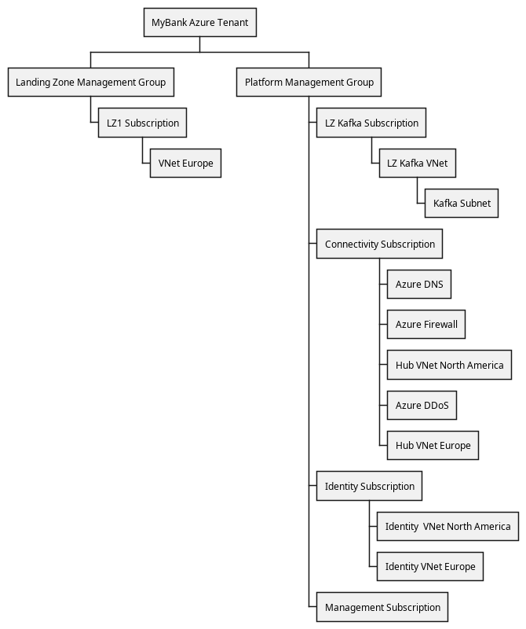

# Azure Deployment View for the MyBank Systems

## Diagramm

## Description
shows the hierarchical structure of the Azure platform deployment

## Nodes
| Name | Technology | Description |
|---|---|---|
| [MyBank Azure Tenant](../mybank/it-management/azure/mybank-tenant.md) | Azure | Azure Tenant for MyBank |

(generated with docs/views/deployment-structure-view.md.cmb)
