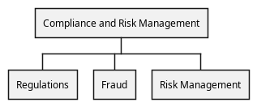

# Compliance and Risk Management (Org-unit)
## Description
Responsible for the compliance and risk management

## Parent
[My Bank](../../mybank/my-bank-organization.md)

## Sub Units
| Org-unit | Description |
|---|---|
| [Fraud](../../mybank/compliance/fraud-unit.md)| Responsible for the fraud detection and mitigation |
| [Regulations](../../mybank/compliance/regulations-unit.md)| Responsible for the compliance and regulations |
| [Risk Management](../../mybank/compliance/risk-management-unit.md)| Responsible for the risk management |

## Organization Structure

[Org Chart of the Compliance and Risk Management unit](../../mybank/compliance/organization-structure-view.md)

## Navigation
[List of views in namespace](./views-in-namespace.md)

[List of all Views](../../views.md)

(generated by [Overarch](https://github.com/soulspace-org/overarch) with template docs/node.md.cmb)
