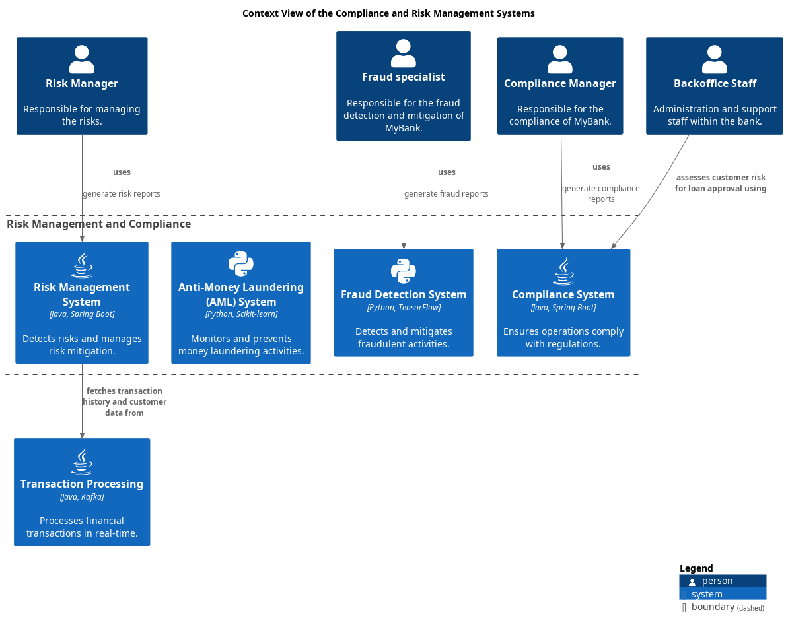

# Fraud Detection System
## Description
Detects and mitigates fraudulent activities.

## Technology
Python, TensorFlow

## Interfaces

## System Context View

[Compliance & Risk Management Context View](../../mybank/compliance/context-view.md)

(generated with docs/architecture-node.md.cmb)
