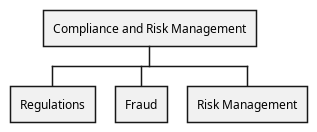

# Fraud (Org-unit)
## Description
Responsible for the fraud detection and mitigation

## Parent
[Compliance and Risk Management](../../mybank/compliance/compliance-unit.md)

## Roles
| Person/Role | Description |
|---|---|
| [Fraud specialist](../../mybank/compliance/fraud-specialist.md)| Responsible for the fraud detection and mitigation of MyBank. |

## Organization Structure

[Org Chart of the Compliance and Risk Management unit](../../mybank/compliance/organization-structure-view.md)

## Navigation
[List of views in namespace](./views-in-namespace.md)

[List of all Views](../../views.md)

(generated by [Overarch](https://github.com/soulspace-org/overarch) with template docs/node.md.cmb)
