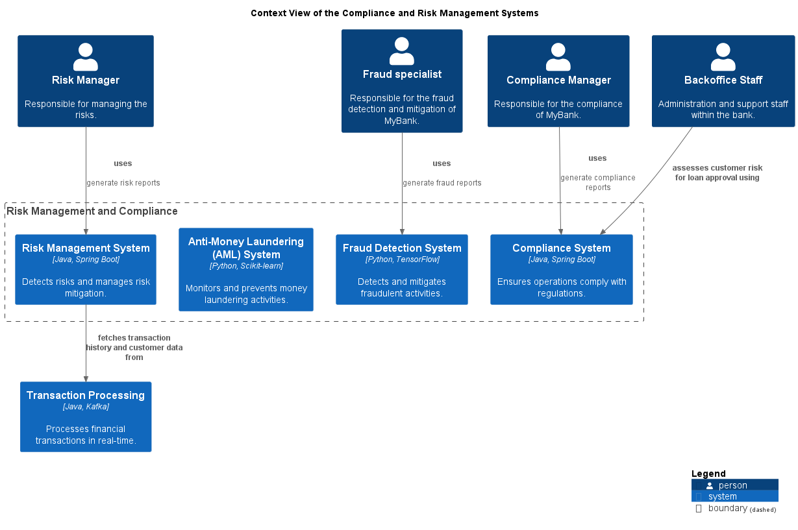

# Risk Management System (System)
## Description
Detects risks and manages risk mitigation.

## Parent
[Risk Management and Compliance](../../mybank/compliance/context-boundary.md)

## Technology
Java, Spring Boot

## Responsibility of Organization Unit
| Org-unit | Description |
|---|---|
| [Risk Management](../../mybank/compliance/risk-management-unit.md)| Responsible for the risk management |
## Incoming Synchronous Requests 
| From | Name | To | Technology | Description |
|---|---|---|---|---|
| [Risk Manager](../../mybank/compliance/risk-manager.md) | uses | [Risk Management System](../../mybank/compliance/risk-management-system.md) |  | generate risk reports |
## Outgoing Synchronous Requests 
| From | Name | To | Technology | Description |
|---|---|---|---|---|
| [Risk Management System](../../mybank/compliance/risk-management-system.md) | fetches transaction history and customer data from | [Transaction Processing](../../mybank/core-banking/transaction-processing-system.md) |  |  |

## System Context View

[Context View of the Compliance and Risk Management Systems](../../mybank/compliance/context-view.md)

## Navigation
[List of views in namespace](./views-in-namespace.md)

[List of all Views](../../views.md)

(generated by [Overarch](https://github.com/soulspace-org/overarch) with template docs/node.md.cmb)
