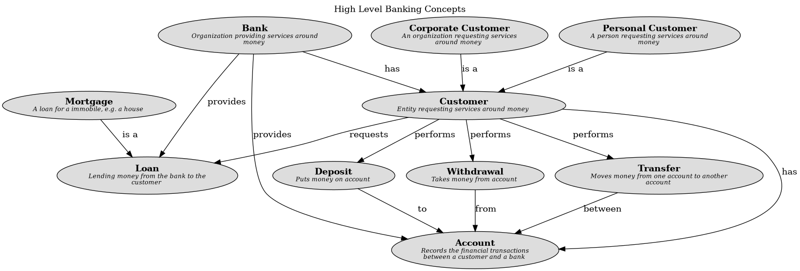

# Deposit (Concept)
## Description
Puts money on account

## Relation from
| From | Name | To | Description |
|---|---|---|---|
| [Customer](../../mybank/concepts/customer.md) | performs | [Deposit](../../mybank/concepts/deposit.md) |  |

## Related to
| From | Name | To | Description |
|---|---|---|---|
| [Deposit](../../mybank/concepts/deposit.md) | to | [Account](../../mybank/concepts/account.md) |  |

## Concept Map

[High Level Banking Concepts](../../mybank/concepts/concept-view.md)

## Navigation
[List of views in namespace](./views-in-namespace.md)

[List of all Views](../../views.md)

(generated with docs/concept.md.cmb)
