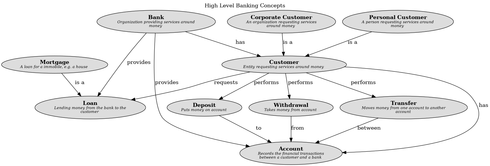

# Mortgage (Concept)
## Description
A loan for a immobile, e.g. a house

## Superordinates
| Concept | Description |
|---|---|
| [Loan](../../mybank/concepts/loan.md)| Lending money from the bank to the customer |

## Concept Map

[High Level Banking Concepts](../../mybank/concepts/concept-view.md)

## Navigation
[List of views in namespace](./views-in-namespace.md)

[List of all Views](../../views.md)

(generated by [Overarch](https://github.com/soulspace-org/overarch) with template docs/node.md.cmb)
