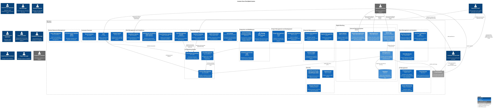

# Container View of the MyBank Systems

## Diagramm

## Description
shows the containers of the MyBank Systems

## User Roles
| Name | Description |
|---|---|
| [Customer Service Staff](../mybank/user-role/customer-service-staff.md) | Customer service staff within the bank. |
| [Cloud FinOps Specialist](../mybank/it-management/cloud-finops-specialist.md) | Operates cloud infrastructure and controls costs |
| [Personal Customer](../mybank/user-role/personal-customer.md) | Personal Customer of MyBank. |
| [Risk Manager](../mybank/compliance/risk-manager.md) | Responsible for managing the risks. |
| [DevOps Engineer](../mybank/project-management/devops-engineer.md) | Develops and operates software systems. |
| [Cloud Operations Specialist](../mybank/it-management/cloud-operations-specialist.md) | Operates cloud infrastructure |
| [Fraud specialist](../mybank/compliance/fraud-specialist.md) | Responsible for the fraud detection and mitigation of MyBank. |
| [Compliance Manager](../mybank/compliance/compliance-manager.md) | Responsible for the compliance of MyBank. |
| [Backoffice Staff](../mybank/user-role/backoffice-staff.md) | Administration and support staff within the bank. |
| [Cloud Solution Architect](../mybank/it-management/cloud-solution-architect.md) | Designs cloud solutions |
| [Project Manager](../mybank/project-management/project-manager.md) | Manages projects at MyBank. |
| [Corporate Customer](../mybank/user-role/corporate-customer.md) | Corporate Customer of MyBank. |
## Systems
| Name | Description |
|---|---|
| [Big Data Analytics](../mybank/data-management/big-data-analytics-system.md) | Advanced analytics for predictive modeling. |
| [Disaster Recovery](../mybank/security/disaster-recovery-system.md) | Ensures business continuity in case of a disaster. |
| [E-mail System](../mybank/email-system.md) | The internal Microsoft Exchange email system. |
| [Expense Management](../mybank/financial-management/expense-management-system.md) | Tracks and manages expenses. |
| [Branch Systems](../mybank/customer-channels/branch-systems.md) | Software and hardware for in-branch banking services. |
| [Fraud Detection System](../mybank/compliance/fraud-detection-system.md) | Detects and mitigates fraudulent activities. |
| [Development Platforms](../mybank/project-management/dev-platforms.md) | Tools for software development, testing, and deployment. |
| [Digital Wallets](../mybank/digital-banking/digital-wallets-system.md) | Supports digital wallet integration and mobile payments. |
| [Identity and Access Management (IAM)](../mybank/security/identity-access-management-system.md) | Manages secure access to systems and data. |
| [Risk Management System](../mybank/compliance/risk-management-system.md) | Detects risks and manages risk mitigation. |
| [Service-Oriented Architecture (SOA)](../mybank/integration-middleware/soa.md) | Framework for enabling seamless integration between services. |
| [Cloud Services](../mybank/infrastructure-management/cloud-services-system.md) | Cloud computing resources for scalability and flexibility. |
| [HR Information Systems (HRIS)](../mybank/human-resources/hris.md) | Manages employee data, payroll, and benefits. |
| [System Monitoring](../mybank/infrastructure-management/system-monitoring-system.md) | Monitors system performance and health. |
| [Compliance System](../mybank/compliance/compliance-system.md) | Ensures operations comply with regulations. |
| [Data Warehouse](../mybank/data-management/data-warehouse-system.md) | Central repository for storing large volumes of data. |
| [Enterprise Service Bus (ESB)](../mybank/integration-middleware/esb.md) | Middleware for integrating various banking systems. |
| [Payment Gateway](../mybank/payment/payment-gateway-system.md) | Facilitates credit/debit card transactions. |
| [API Gateway](../mybank/integration-middleware/api-gateway.md) | Manages APIs for third-party services and fintech apps. |
| [IT Infrastructure](../mybank/infrastructure-management/it-infrastructure-system.md) | Hardware and software resources, including servers and networking. |
| [Project Management Tools](../mybank/project-management/project-management-tools.md) | Platforms for planning, executing, and tracking projects. |
| [Loan Management](../mybank/core-banking/loan-management-system.md) | Manages loan products, applications, and repayments. |
| [ACH System](../mybank/payment/ach-system.md) | Processes ACH transactions for direct deposits and bill payments. |
| [General Ledger](../mybank/financial-management/general-ledger-system.md) | Comprehensive financial accounting and reporting system. |
| [Anti-Money Laundering (AML) System](../mybank/compliance/aml-system.md) | Monitors and prevents money laundering activities. |
| [Business Intelligence (BI)](../mybank/data-management/business-intelligence-system.md) | Provides tools for reporting and data analysis. |
| [ATM](../mybank/customer-channels/atm.md) | Allows customers to withdraw cash. |
| [Contact Center](../mybank/customer-channels/contact-center-system.md) | Telephony and customer support systems for call centers. |
| [Cybersecurity](../mybank/security/cybersecurity-system.md) | Protects against cyber threats. |
| [SWIFT/RTGS/NEFT](../mybank/payment/swift-rtgs-neft-system.md) | Handles interbank transfers and settlements. |
| [Treasury Management](../mybank/financial-management/treasury-management-system.md) | Manages liquidity, investments, and risk in the treasury function. |
| [Account Management](../mybank/core-banking/account-management-system.md) | Handles customer accounts, deposits, and withdrawals. |
| [Transaction Processing](../mybank/core-banking/transaction-processing-system.md) | Processes financial transactions in real-time. |
| [Internet Banking System](../mybank/digital-banking/internet-banking-system.md) | Allows customers to view information about their bank accounts and make payments. |
| [Talent Management](../mybank/human-resources/talent-management-system.md) | Tools for recruitment, training, and performance management. |
## Containers
| Name | Description |
|---|---|
| [Database](../mybank/digital-banking/database.md) | Stores user registration, authentication, and access logs. |
| [Single-Page Application](../mybank/digital-banking/single-page-app.md) | Provides internet banking functionality to customers via their web browser. |
| [Web Application](../mybank/digital-banking/web-app.md) | Delivers the static content and the internet banking single-page application. |
| [API Application](../mybank/digital-banking/api-application.md) | Provides internet banking functionality via a RESTful JSON/HTTPS API. |
| [Mobile App](../mybank/digital-banking/mobile-app.md) | Provides limited internet banking functionality to customers via mobile devices. |

(generated with docs/views/container-view.md.cmb)
