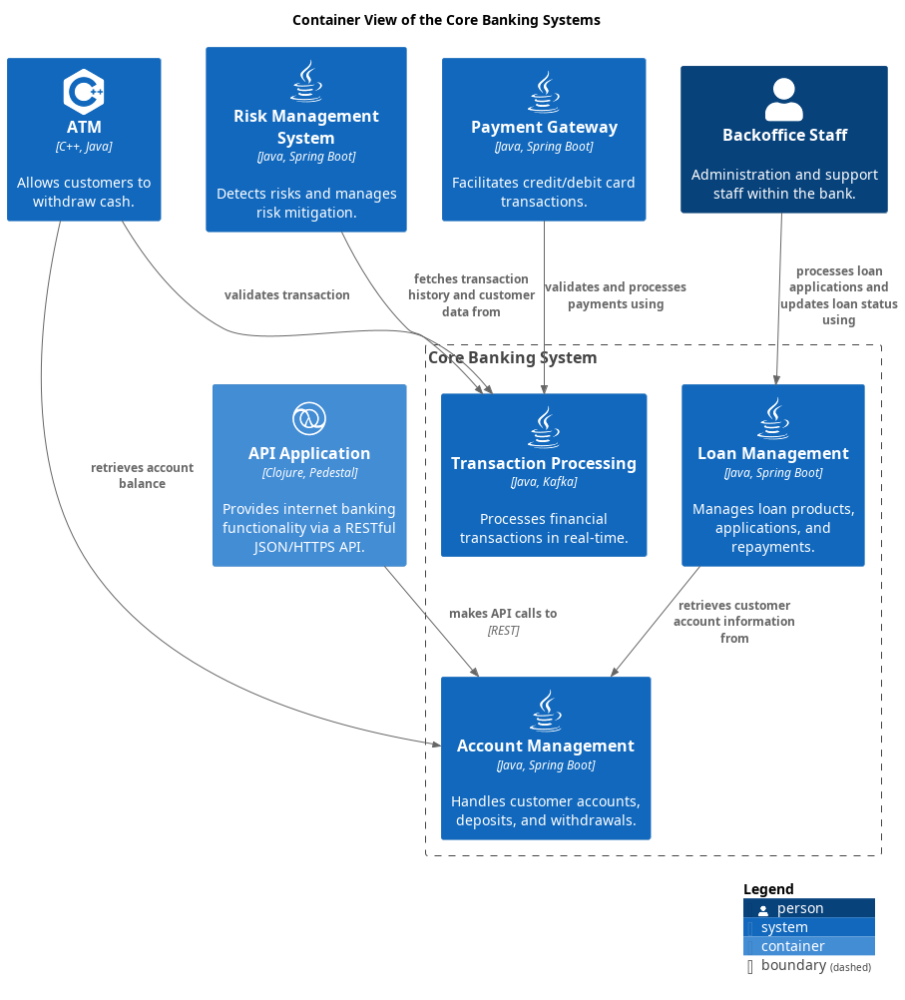

# Core Banking System (Context-boundary)
## Description
Manages customer accounts, transactions, and loans.

## Technology

## Parent
[My Bank](../../mybank/mybank-plc.md)

## Interfaces

## Container View

[Container View of the Core Banking Systems](../../mybank/core-banking/container-view.md)

## Navigation
[List of views in namespace](./views-in-namespace.md)

[List of all Views](../../views.md)

(generated with docs/architecture-node.md.cmb)
