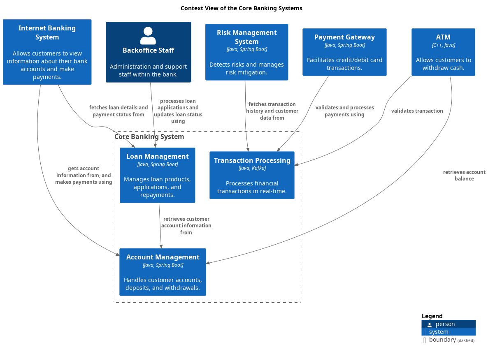

# Context View of the Core Banking Systems

## Diagram

## Description
Shows the systems of the domain Core Banking and their relations.
## Systems
| Name | Description |
|---|---|
| [Account Management](../../mybank/core-banking/account-management-system.md) | Handles customer accounts, deposits, and withdrawals. |
| [Loan Management](../../mybank/core-banking/loan-management-system.md) | Manages loan products, applications, and repayments. |
| [Transaction Processing](../../mybank/core-banking/transaction-processing-system.md) | Processes financial transactions in real-time. |

## Navigation
[List of Views](../../views.md)

(generated with docs/views/context-view.md.cmb)
