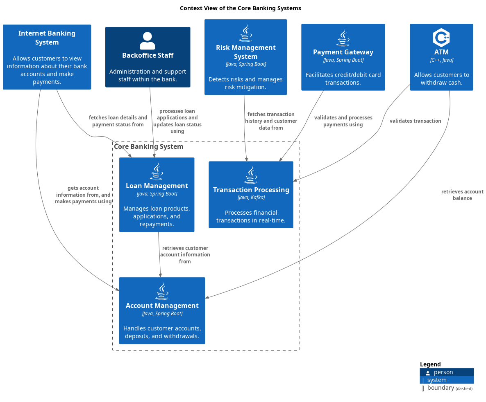

# Loan Management (System)
## Description
Manages loan products, applications, and repayments.

## Technology
Java, Spring Boot

## Parent
[Core Banking System](../../mybank/core-banking/context-boundary.md)

## Interfaces

### Synchronous Interfaces

#### Service
| Name | Called From | Technology | Description |
|---|---|---|---|
| fetches loan details and payment status from | [Internet Banking System](../../mybank/digital-banking/internet-banking-system/internet-banking-system.md) |  |  |

#### Client
| Name | Provided By | Technology | Description |
|---|---|---|---|
| retrieves customer account information from | [Account Management](../../mybank/core-banking/account-management-system.md) |  |  |

## System Context View

[Context View of the Core Banking Systems](../../mybank/core-banking/context-view.md)

## Navigation
[List of views in namespace](./views-in-namespace.md)

[List of all Views](../../views.md)

(generated with docs/architecture-node.md.cmb)
