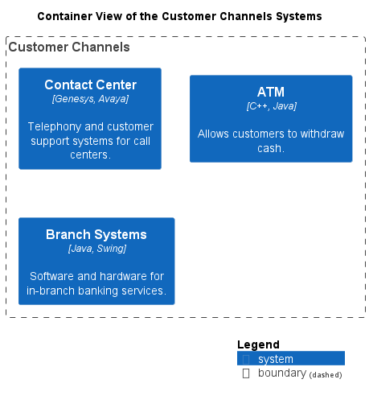

# Customer Channels (Context-boundary)
## Description
Interfaces for customer interaction, including branch systems, ATMs, and call centers.

## Technology

## Parent
[My Bank](../../mybank/mybank-plc.md)

## Interfaces

## Container View

[Container View of the Customer Channels Systems](../../mybank/customer-channels/container-view.md)

## Navigation
[List of views in namespace](./views-in-namespace.md)

[List of all Views](../../views.md)

(generated with docs/architecture-node.md.cmb)
