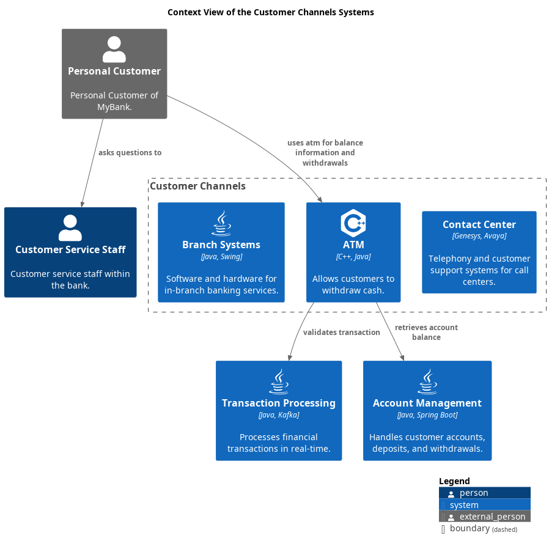

# Context View of the Customer Channels Systems

## Diagram

## Description
Shows the systems of the domain Customer Channels and their relations.

## Roles
| Person/Role | Description |
|---|---|
| [Customer Service Staff](../../mybank/customer-channels/customer-service-staff.md)| Customer service staff within the bank. |
| [Personal Customer](../../mybank/personal-customer.md)| Personal Customer of MyBank. |

## Systems
| System | Description |
|---|---|
| [ATM](../../mybank/customer-channels/atm.md)| Allows customers to withdraw cash. |
| [Account Management](../../mybank/core-banking/account-management-system.md)| Handles customer accounts, deposits, and withdrawals. |
| [Branch Systems](../../mybank/customer-channels/branch-systems.md)| Software and hardware for in-branch banking services. |
| [Contact Center](../../mybank/customer-channels/contact-center-system.md)| Telephony and customer support systems for call centers. |
| [Transaction Processing](../../mybank/core-banking/transaction-processing-system.md)| Processes financial transactions in real-time. |

## Synchronous Requests
| From | Name | To | Technology | Description |
|---|---|---|---|---|
| [Personal Customer](../../mybank/personal-customer.md) | uses atm for balance information and withdrawals | [ATM](../../mybank/customer-channels/atm.md) |  |

## Other Relationships
| From | Name | To | Description |
|---|---|---|---|
| [Personal Customer](../../mybank/personal-customer.md) | asks questions to | [Customer Service Staff](../../mybank/customer-channels/customer-service-staff.md) |  |
| [ATM](../../mybank/customer-channels/atm.md) | retrieves account balance | [Account Management](../../mybank/core-banking/account-management-system.md) |  |
| [ATM](../../mybank/customer-channels/atm.md) | validates transaction | [Transaction Processing](../../mybank/core-banking/transaction-processing-system.md) |  |

## Navigation
[List of views in namespace](./views-in-namespace.md)

[List of all Views](../../views.md)

(generated by [Overarch](https://github.com/soulspace-org/overarch) with template docs/views/view.md.cmb)

