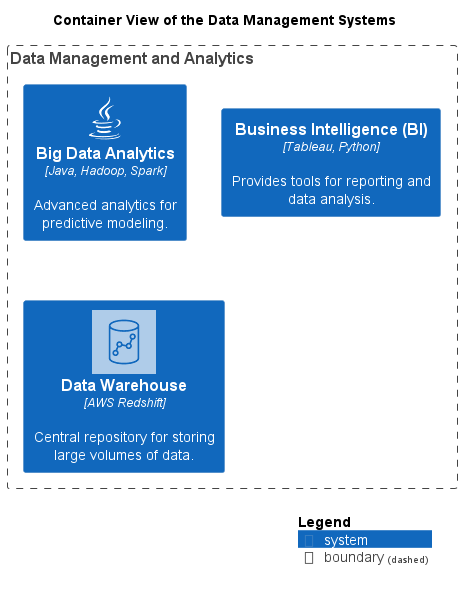

# Container View of the Data Management Systems

## Diagram

## Description
Shows the systems and containers of the domain Data Management and their relations.
## Systems
| Name | Description |
|---|---|
| [Big Data Analytics](../../mybank/data-management/big-data-analytics-system.md) | Advanced analytics for predictive modeling. |
| [Business Intelligence (BI)](../../mybank/data-management/business-intelligence-system.md) | Provides tools for reporting and data analysis. |
| [Data Warehouse](../../mybank/data-management/data-warehouse-system.md) | Central repository for storing large volumes of data. |

## Navigation
[List of views in namespace](./views-in-namespace.md)
[List of all Views](../../views.md)

(generated with docs/views/container-view.md.cmb)
