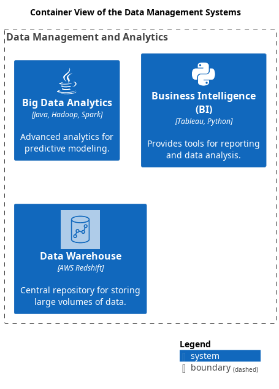

# Data Management and Analytics (Context-boundary)
## Description
Manages data storage, warehousing, and analytics.

## Parent
[My Bank](../../mybank/mybank-plc.md)

## Container View

[Container View of the Data Management Systems](../../mybank/data-management/container-view.md)

## Navigation
[List of views in namespace](./views-in-namespace.md)

[List of all Views](../../views.md)

(generated by [Overarch](https://github.com/soulspace-org/overarch) with template docs/node.md.cmb)
