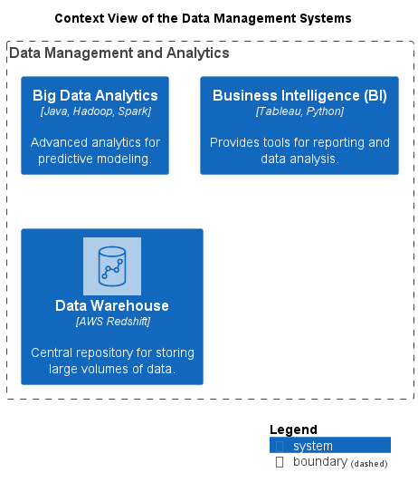

# Context View of the Data Management Systems

## Diagramm

## Description
Shows the systems of the domain Data Management and their relations.
## Systems
| Name | Description |
|---|---|
| [Big Data Analytics](../../mybank/data-management/big-data-analytics-system.md) | Advanced analytics for predictive modeling. |
| [Data Warehouse](../../mybank/data-management/data-warehouse-system.md) | Central repository for storing large volumes of data. |
| [Business Intelligence (BI)](../../mybank/data-management/business-intelligence-system.md) | Provides tools for reporting and data analysis. |

(generated with docs/views/context-view.md.cmb)
