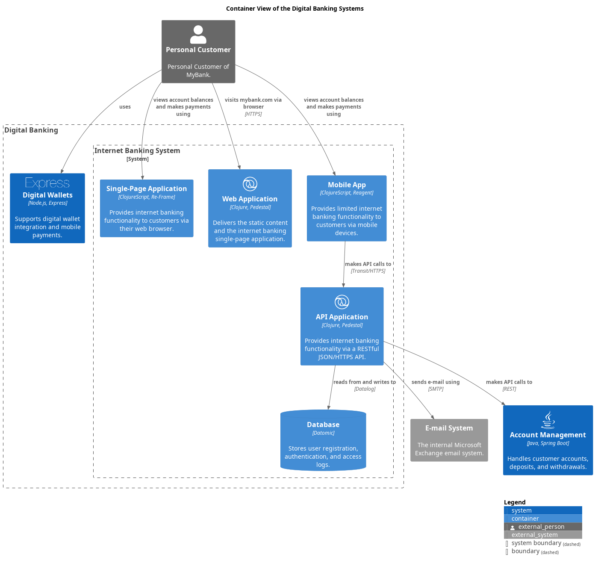

# API Application
## Description
Provides internet banking functionality via a RESTful JSON/HTTPS API.

## Technology
Clojure and Liberator

## Components
These components show the internal structure of the API Application container.

| Component | Description |
|---|---|
| [Accounts Summary Controller](../../mybank/digital-banking/accounts-summary-controller.md) | Provides customers with a summary of their bank accounts. |
| [Core Banking Systems Facade](../../mybank/digital-banking/core-banking-systems-facade.md) | Facilitates interaction with the core banking systems. |
| [E-mail Component](../../mybank/digital-banking/email-component.md) | Sends e-mails to users. |
| [Reset Password Controller](../../mybank/digital-banking/reset-password-controller.md) | Allows users to reset their passwords. |
| [Security Component](../../mybank/digital-banking/security-component.md) | Handles authentication, password changes, etc. |
| [Sign In Controller](../../mybank/digital-banking/sign-in-controller.md) | Allows users to sign in to the banking system. |

## Interfaces

### Synchronous Interfaces

#### Service
| Name | Called From | Technology | Description |
|---|---|---|---|
| makes API calls to | [Mobile App](../../mybank/digital-banking/mobile-app.md) | Transit/HTTPS |  |

#### Client
| Name | Provided By | Technology | Description |
|---|---|---|---|
| makes API calls to | [Account Management](../../mybank/core-banking/account-management-system.md) | REST |  |
| sends e-mail using | [E-mail System](../../mybank/email-system.md) |  |  |
| reads from and writes to | [Database](../../mybank/digital-banking/database.md) | Datalog |  |

## Container View

[Digital Banking Container View](../../mybank/digital-banking/container-view.md)

(generated with docs/architecture-node.md.cmb)
