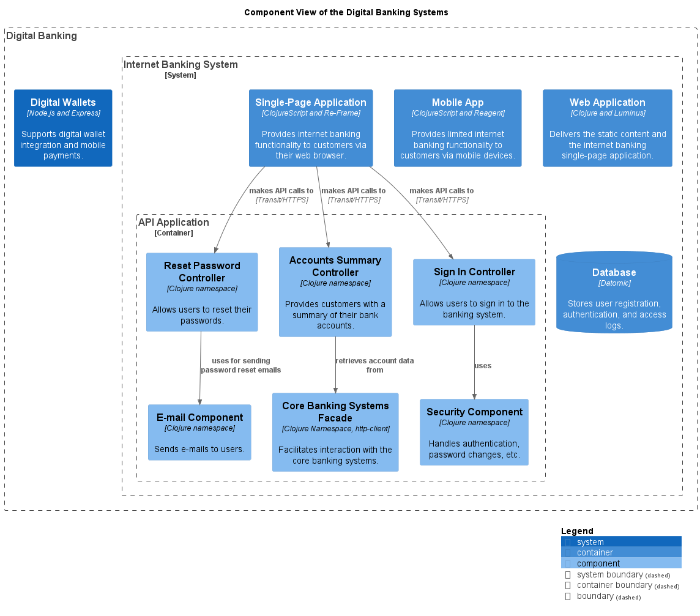

# Component View of the Digital Banking Systems

## Diagramm

## Description
Shows the systems, containers and components of the domain Digital Banking and their relations.
## Systems
| Name | Description |
|---|---|
| [Digital Wallets](../../mybank/digital-banking/digital-wallets-system.md) | Supports digital wallet integration and mobile payments. |
| [Internet Banking System](../../mybank/digital-banking/internet-banking-system.md) | Allows customers to view information about their bank accounts and make payments. |
## Containers
| Name | Description |
|---|---|
| [API Application](../../mybank/digital-banking/api-application.md) | Provides internet banking functionality via a RESTful JSON/HTTPS API. |
| [Database](../../mybank/digital-banking/database.md) | Stores user registration, authentication, and access logs. |
| [Mobile App](../../mybank/digital-banking/mobile-app.md) | Provides limited internet banking functionality to customers via mobile devices. |
| [Single-Page Application](../../mybank/digital-banking/single-page-app.md) | Provides internet banking functionality to customers via their web browser. |
| [Web Application](../../mybank/digital-banking/web-app.md) | Delivers the static content and the internet banking single-page application. |
## Components
| Name | Description |
|---|---|
| [Accounts Summary Controller](../../mybank/digital-banking/accounts-summary-controller.md) | Provides customers with a summary of their bank accounts. |
| [Core Banking Systems Facade](../../mybank/digital-banking/core-banking-systems-facade.md) | Facilitates interaction with the core banking systems. |
| [E-mail Component](../../mybank/digital-banking/email-component.md) | Sends e-mails to users. |
| [Reset Password Controller](../../mybank/digital-banking/reset-password-controller.md) | Allows users to reset their passwords. |
| [Security Component](../../mybank/digital-banking/security-component.md) | Handles authentication, password changes, etc. |
| [Sign In Controller](../../mybank/digital-banking/sign-in-controller.md) | Allows users to sign in to the banking system. |

(generated with docs/views/component-view.md.cmb)
