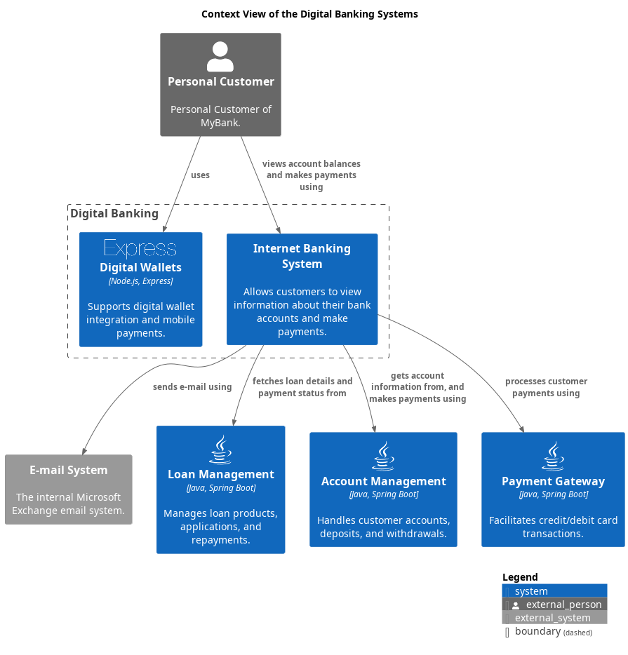

# Context View of the Digital Banking Systems

## Diagram

## Description
Shows the systems of the domain Digital Banking and their relations.
## User Roles
| Name | Description |
|---|---|
| [Personal Customer](../../mybank/personal-customer.md) | Personal Customer of MyBank. |
## Systems
| Name | Description |
|---|---|
| [Account Management](../../mybank/core-banking/account-management-system.md) | Handles customer accounts, deposits, and withdrawals. |
| [Digital Wallets](../../mybank/digital-banking/digital-wallets-system.md) | Supports digital wallet integration and mobile payments. |
| [E-mail System](../../mybank/email-system.md) | The internal Microsoft Exchange email system. |
| [Internet Banking System](../../mybank/digital-banking/internet-banking-system/internet-banking-system.md) | Allows customers to view information about their bank accounts and make payments. |
| [Loan Management](../../mybank/core-banking/loan-management-system.md) | Manages loan products, applications, and repayments. |
| [Payment Gateway](../../mybank/payment/payment-gateway-system.md) | Facilitates credit/debit card transactions. |

## Navigation
[List of views in namespace](./views-in-namespace.md)
[List of all Views](../../views.md)

(generated with docs/views/context-view.md.cmb)
