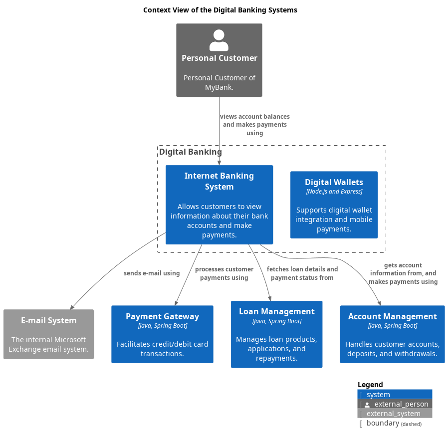

# Digital Wallets (System)
## Description
Supports digital wallet integration and mobile payments.

## Parent
[Digital Banking](../../mybank/digital-banking/context-boundary.md)

## Technology
Node.js and Express
## Incoming Synchronous Requests 
| From | Name | To | Technology | Description |
|---|---|---|---|---|
| [Personal Customer](../../mybank/personal-customer.md) | uses | [Digital Wallets](../../mybank/digital-banking/digital-wallets-system.md) |  |  |

## System Context View

[Context View of the Digital Banking Systems](../../mybank/digital-banking/context-view.md)

## Navigation
[List of views in namespace](./views-in-namespace.md)

[List of all Views](../../views.md)

(generated by [Overarch](https://github.com/soulspace-org/overarch) with template docs/node.md.cmb)
