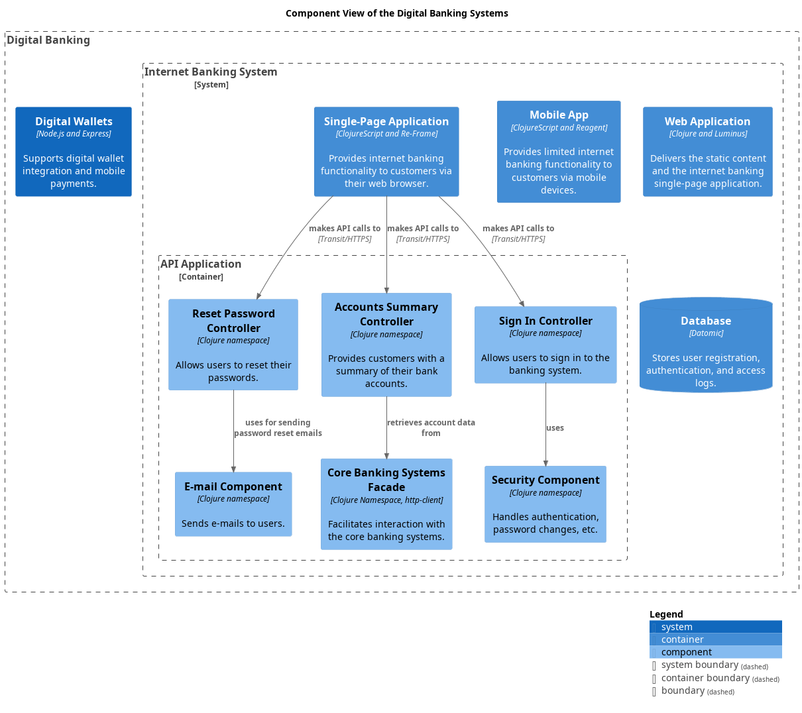

# E-mail Component
## Description
Sends e-mails to users.

## Technology
Clojure namespace

## Interfaces

### Synchronous Interfaces

#### Service
| Name | Called From | Technology | Description |
|---|---|---|---|
| uses for sending password reset emails | [Reset Password Controller](../../mybank/digital-banking/reset-password-controller.md) |  |  |

## Component View

[Digital Banking Component View](../../mybank/digital-banking/component-view.md)

(generated with docs/architecture-node.md.cmb)
