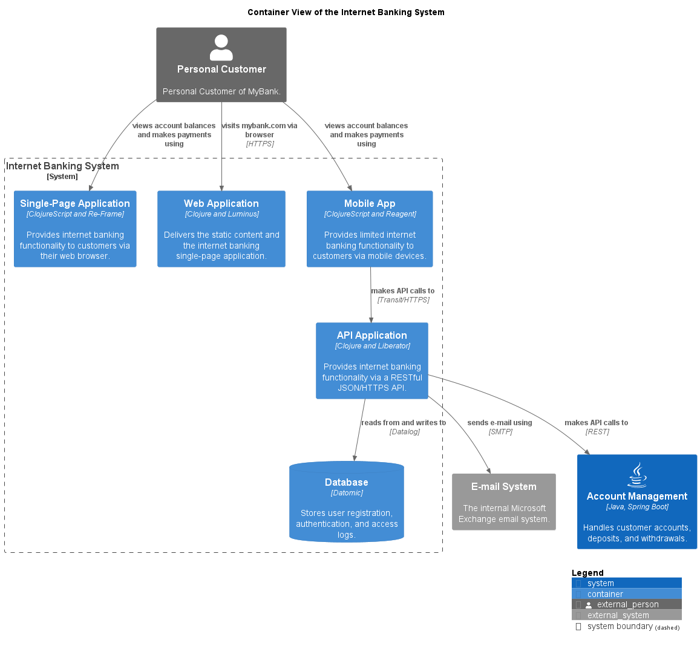

# Database (Container)
## Description
Stores user registration, authentication, and access logs.

## Technology
Datomic

## Parent
[Internet Banking System](../../../mybank/digital-banking/internet-banking-system/internet-banking-system.md)

## Interfaces

### Synchronous Interfaces

#### Provided Services

| From | Name | To | Description | Technology |
|---|---|---|---|---|
| [API Application](../../../mybank/digital-banking/internet-banking-system/api-application.md) | reads from and writes to | [Database](../../../mybank/digital-banking/internet-banking-system/database.md) |  | Datalog |

## Container View

[Container View of the Internet Banking System](../../../mybank/digital-banking/internet-banking-system/container-view.md)

## Navigation
[List of views in namespace](./views-in-namespace.md)

[List of all Views](../../../views.md)

(generated with docs/architecture-node.md.cmb)
