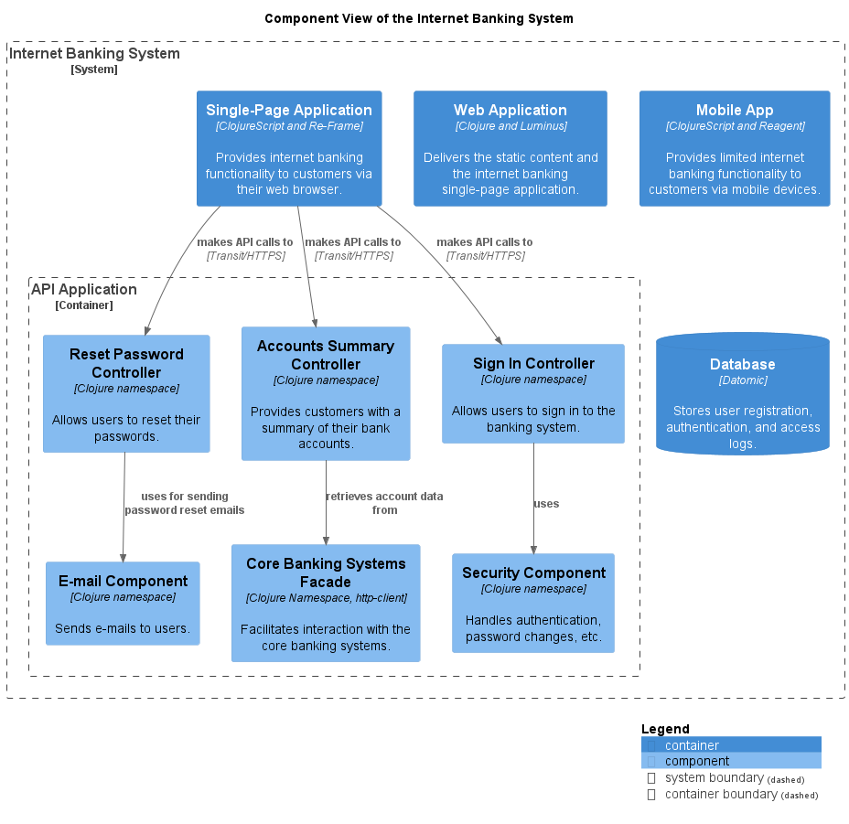

# Reset Password Controller (Component)
## Description
Allows users to reset their passwords.

## Technology
Clojure namespace

## Interfaces

### Synchronous Interfaces

#### Service
| Name | Called From | Technology | Description |
|---|---|---|---|
| makes API calls to | [Single-Page Application](../../../mybank/digital-banking/internet-banking-system/single-page-app.md) | Transit/HTTPS |  |

#### Client
| Name | Provided By | Technology | Description |
|---|---|---|---|
| uses for sending password reset emails | [E-mail Component](../../../mybank/digital-banking/internet-banking-system/email-component.md) |  |  |

## Component View

[Internet Banking System Component View](../../../mybank/digital-banking/internet-banking-system/component-view.md)

(generated with docs/architecture-node.md.cmb)
