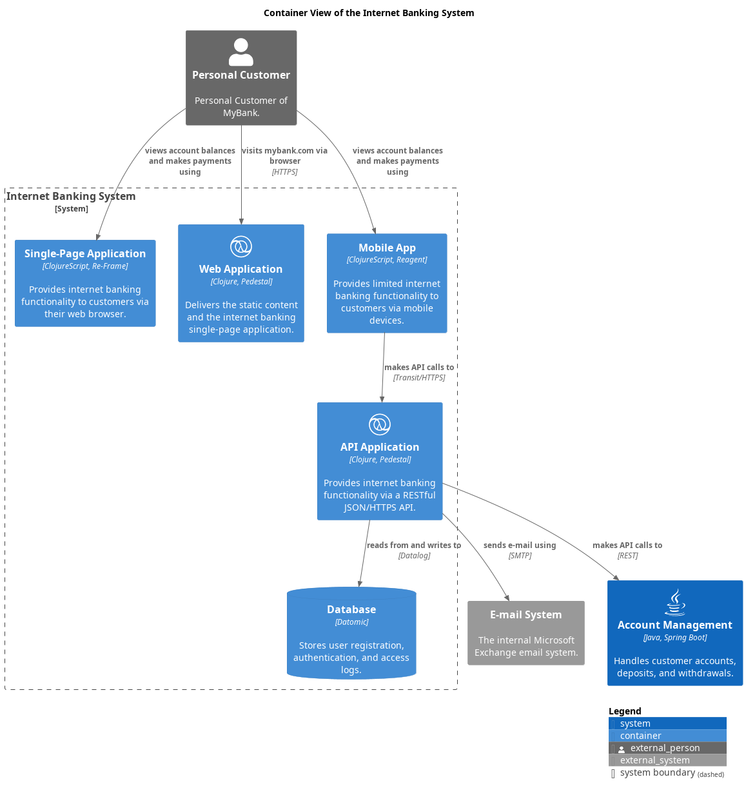

# Single-Page Application (Container)
## Description
Provides internet banking functionality to customers via their web browser.

## Parent
[Internet Banking System](../../../mybank/digital-banking/internet-banking-system/internet-banking-system.md)

## Technology
ClojureScript and Re-Frame
## Incoming Synchronous Requests 
| From | Name | To | Technology | Description |
|---|---|---|---|---|
| [Personal Customer](../../../mybank/personal-customer.md) | views account balances and makes payments using | [Single-Page Application](../../../mybank/digital-banking/internet-banking-system/single-page-app.md) |  |  |
## Outgoing Synchronous Requests 
| From | Name | To | Technology | Description |
|---|---|---|---|---|
| [Single-Page Application](../../../mybank/digital-banking/internet-banking-system/single-page-app.md) | makes API calls to | [Accounts Summary Controller](../../../mybank/digital-banking/internet-banking-system/accounts-summary-controller.md) | Transit/HTTPS |  |
| [Single-Page Application](../../../mybank/digital-banking/internet-banking-system/single-page-app.md) | makes API calls to | [Reset Password Controller](../../../mybank/digital-banking/internet-banking-system/reset-password-controller.md) | Transit/HTTPS |  |
| [Single-Page Application](../../../mybank/digital-banking/internet-banking-system/single-page-app.md) | makes API calls to | [Sign In Controller](../../../mybank/digital-banking/internet-banking-system/sign-in-controller.md) | Transit/HTTPS |  |

## Container View

[Container View of the Internet Banking System](../../../mybank/digital-banking/internet-banking-system/container-view.md)

## Navigation
[List of views in namespace](./views-in-namespace.md)

[List of all Views](../../../views.md)

(generated by [Overarch](https://github.com/soulspace-org/overarch) with template docs/node.md.cmb)
