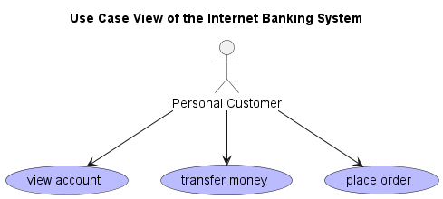

# Use Case View of the Internet Banking System

## Diagram

## Description
Shows the use cases and actors of the Internet Banking System.

## Roles
| Person/Role | Description |
|---|---|
| [Personal Customer](../../../mybank/personal-customer.md)| Personal Customer of MyBank. |

## Use Cases
| Use Case | Description |
|---|---|
| [place order](../../../mybank/digital-banking/internet-banking-system/place-order.md)| place an order for an account |
| [transfer money](../../../mybank/digital-banking/internet-banking-system/transfer-money.md)| transfer money from one account to another |
| [view account](../../../mybank/digital-banking/internet-banking-system/view-account.md)| view the details of an account |

## Uses
| From | Name | To | Description |
|---|---|---|---|
| [Personal Customer](../../../mybank/personal-customer.md) | wants to | [place order](../../../mybank/digital-banking/internet-banking-system/place-order.md) |  |
| [Personal Customer](../../../mybank/personal-customer.md) | wants to | [view account](../../../mybank/digital-banking/internet-banking-system/view-account.md) |  |
| [Personal Customer](../../../mybank/personal-customer.md) | wants to | [transfer money](../../../mybank/digital-banking/internet-banking-system/transfer-money.md) |  |

## Navigation
[List of views in namespace](./views-in-namespace.md)

[List of all Views](../../../views.md)

(generated by [Overarch](https://github.com/soulspace-org/overarch) with template docs/views/view.md.cmb)

