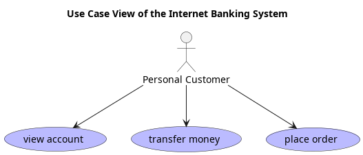

# view account (Use-case)
## Level
User-goal

## Description
view the details of an account
## Actors
| Name | Type | Description |
|---|---|---|
| [Personal Customer](../../../mybank/personal-customer.md) | :person | Personal Customer of MyBank. |

## Use Case View

[Use Case View of the Internet Banking System](../../../mybank/digital-banking/internet-banking-system/use-case-view.md)

## Navigation
[List of views in namespace](./views-in-namespace.md)
[List of all Views](../../../views.md)

(generated with docs/use-case.md.cmb)
