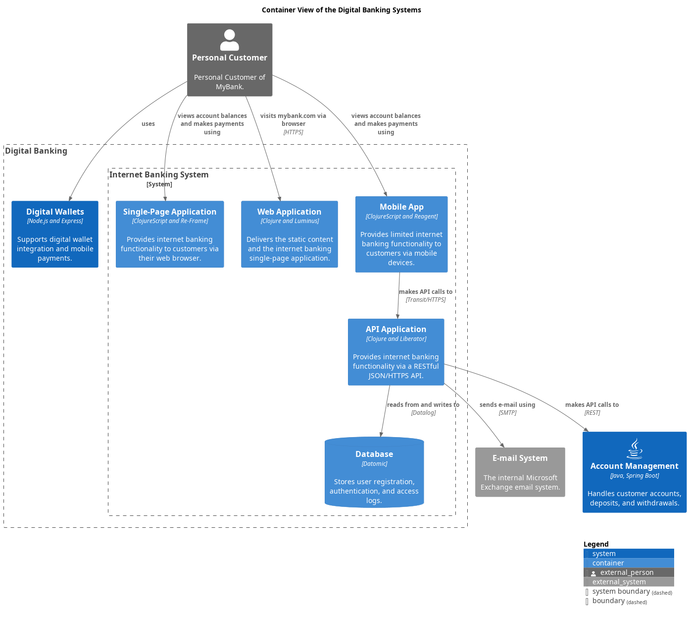

# Mobile App
## Description
Provides limited internet banking functionality to customers via mobile devices.

## Technology
ClojureScript and Reagent

## Interfaces

### Synchronous Interfaces

#### Service
| Name | Called From | Technology | Description |
|---|---|---|---|
| views account balances and makes payments using | [Personal Customer](../../mybank/personal-customer.md) |  |  |

#### Client
| Name | Provided By | Technology | Description |
|---|---|---|---|
| makes API calls to | [API Application](../../mybank/digital-banking/api-application.md) | Transit/HTTPS |  |

## Container View

[Digital Banking Container View](../../mybank/digital-banking/container-view.md)

(generated with docs/architecture-node.md.cmb)
