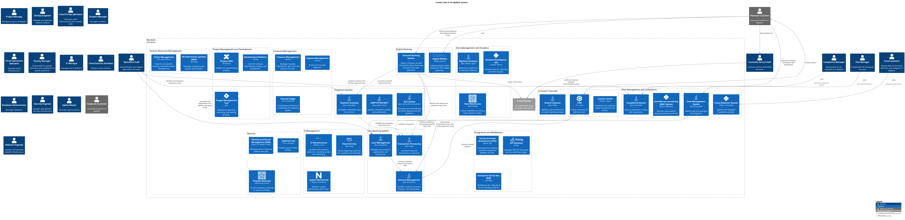

# E-mail System (System)
## Description
The internal Microsoft Exchange email system.

## Parent
[My Bank](../mybank/mybank-plc.md)
## Other Relations
| From | Name | To | Description |
|---|---|---|---|
| [Customer Service Staff](../mybank/customer-channels/customer-service-staff.md) | sends and receives customer communication using | [E-mail System](../mybank/email-system.md) |  |
## Incoming Synchronous Requests 
| From | Name | To | Technology | Description |
|---|---|---|---|---|
| [API Application](../mybank/digital-banking/internet-banking-system/api-application.md) | sends e-mail using | [E-mail System](../mybank/email-system.md) | SMTP |  |
| [Internet Banking System](../mybank/digital-banking/internet-banking-system/internet-banking-system.md) | sends e-mail using | [E-mail System](../mybank/email-system.md) |  |  |
## Outgoing Asynchronous Sends
| From | Name | To | Technology | Description |
|---|---|---|---|---|
| [E-mail System](../mybank/email-system.md) | sends e-mail to | [Personal Customer](../mybank/personal-customer.md) |  |  |

## System Context View

[Context View of the MyBank Systems](../mybank/context-view.md)

## Navigation
[List of views in namespace](./views-in-namespace.md)

[List of all Views](../views.md)

(generated by [Overarch](https://github.com/soulspace-org/overarch) with template docs/node.md.cmb)
