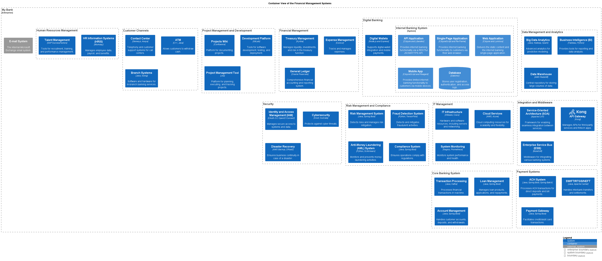

# Container View of the Financial Management Systems

## Diagram

## Description
Shows the systems and containers of the domain Financial Management and their relations.

## Subdomains/Bounded Contexts
| Subdomain/Bounded Context | Description |
|---|---|
| [Financial Management](../../mybank/financial-management/context-boundary.md)| Handles financial accounting, treasury, and expense management. |

## Systems
| System | Description |
|---|---|
| [Expense Management](../../mybank/financial-management/expense-management-system.md)| Tracks and manages expenses. |
| [General Ledger](../../mybank/financial-management/general-ledger-system.md)| Comprehensive financial accounting and reporting system. |
| [Treasury Management](../../mybank/financial-management/treasury-management-system.md)| Manages liquidity, investments, and risk in the treasury function. |

## Navigation
[List of views in namespace](./views-in-namespace.md)

[List of all Views](../../views.md)

(generated by [Overarch](https://github.com/soulspace-org/overarch) with template docs/view.md.cmb)

