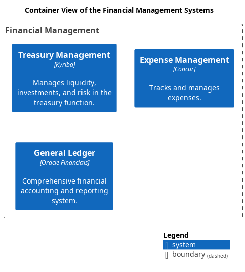

# Container View of the Financial Management Systems

## Diagramm

## Description
Shows the systems and containers of the domain Financial Management and their relations.
## Systems
| Name | Description |
|---|---|
| [Expense Management](../../mybank/financial-management/expense-management-system.md) | Tracks and manages expenses. |
| [General Ledger](../../mybank/financial-management/general-ledger-system.md) | Comprehensive financial accounting and reporting system. |
| [Treasury Management](../../mybank/financial-management/treasury-management-system.md) | Manages liquidity, investments, and risk in the treasury function. |

(generated with docs/views/container-view.md.cmb)
