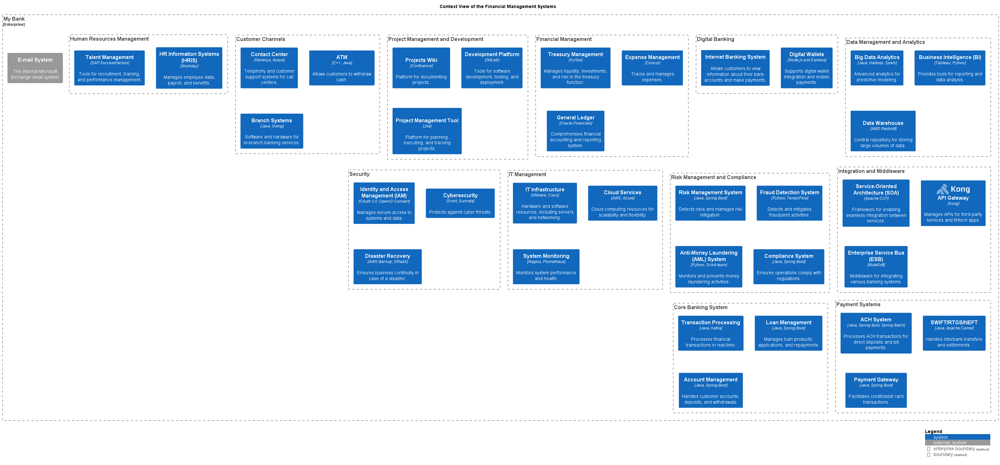

# Treasury Management
## Description
Manages liquidity, investments, and risk in the treasury function.

## Technology
Kyriba

## Interfaces

## System Context View

[Financial Management Context View](../../mybank/financial-management/context-view.md)

(generated with docs/architecture-node.md.cmb)
