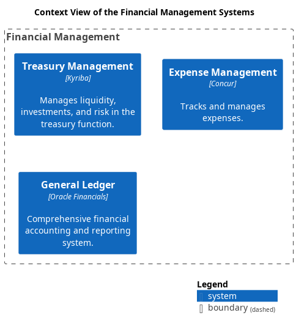

# Treasury Management (System)
## Description
Manages liquidity, investments, and risk in the treasury function.

## Parent
[Financial Management](../../mybank/financial-management/context-boundary.md)

## Technology
Kyriba

## System Context View

[Context View of the Financial Management Systems](../../mybank/financial-management/context-view.md)

## Navigation
[List of views in namespace](./views-in-namespace.md)

[List of all Views](../../views.md)

(generated by [Overarch](https://github.com/soulspace-org/overarch) with template docs/node.md.cmb)
