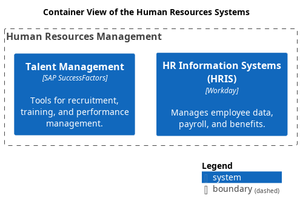

# Container View of the Human Resources Systems

## Diagram

## Description
Shows the systems and containers of the domain Human Resources and their relations.

## Subdomains/Bounded Contexts
| Subdomain/Bounded Context | Description |
|---|---|
| [Human Resources Management](../../mybank/human-resources/context-boundary.md)| Manages employee information, payroll, and talent management. |

## Systems
| System | Description |
|---|---|
| [HR Information Systems (HRIS)](../../mybank/human-resources/hris.md)| Manages employee data, payroll, and benefits. |
| [Talent Management](../../mybank/human-resources/talent-management-system.md)| Tools for recruitment, training, and performance management. |

## Navigation
[List of views in namespace](./views-in-namespace.md)

[List of all Views](../../views.md)

(generated by [Overarch](https://github.com/soulspace-org/overarch) with template docs/views/view.md.cmb)

