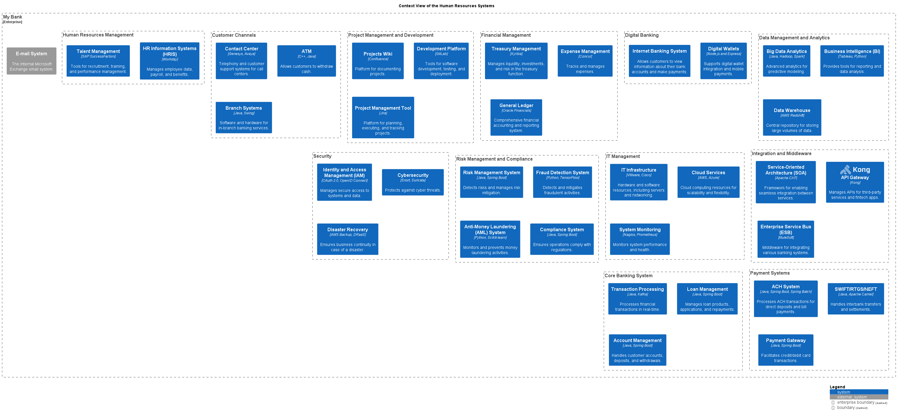

# HR Information Systems (HRIS) (System)
## Description
Manages employee data, payroll, and benefits.

## Technology
Workday

## Interfaces

## System Context View

[Context View of the Human Resources Systems](../../mybank/human-resources/context-view.md)

## Navigation
[List of views in namespace](./views-in-namespace.md)

[List of all Views](../../views.md)

(generated with docs/architecture-node.md.cmb)
