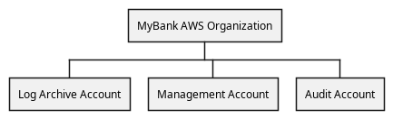

# AWS Deployment View for the MyBank Systems

## Diagram

## Description
Shows the hierarchical structure of the AWS platform deployment

## Deployment Nodes
| Node | Description |
|---|---|
| [MyBank AWS Organization](../../../mybank/it-management/aws/mybank-aws-organization.md)| AWS Organization for MyBank |

## Navigation
[List of views in namespace](./views-in-namespace.md)

[List of all Views](../../../views.md)

(generated by [Overarch](https://github.com/soulspace-org/overarch) with template docs/view.md.cmb)

