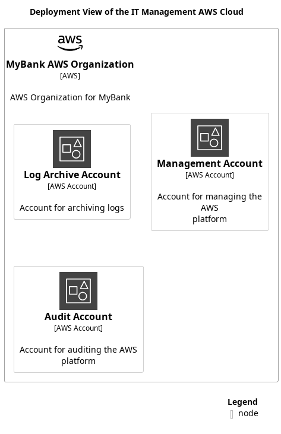

# Deployment View of the IT Management AWS Cloud

## Diagram

## Description
Shows the nodes and containers of the IT management AWS cloud infrastructure.

## Deployment Nodes
| Node | Description |
|---|---|
| [Audit Account](../../../mybank/it-management/aws/audit-account.md)| Account for auditing the AWS platform |
| [Log Archive Account](../../../mybank/it-management/aws/log-archive-account.md)| Account for archiving logs |
| [Management Account](../../../mybank/it-management/aws/platform-management-account.md)| Account for managing the AWS platform |
| [MyBank AWS Organization](../../../mybank/it-management/aws/mybank-aws-organization.md)| AWS Organization for MyBank |

## Navigation
[List of views in namespace](./views-in-namespace.md)

[List of all Views](../../../views.md)

(generated by [Overarch](https://github.com/soulspace-org/overarch) with template docs/views/view.md.cmb)

