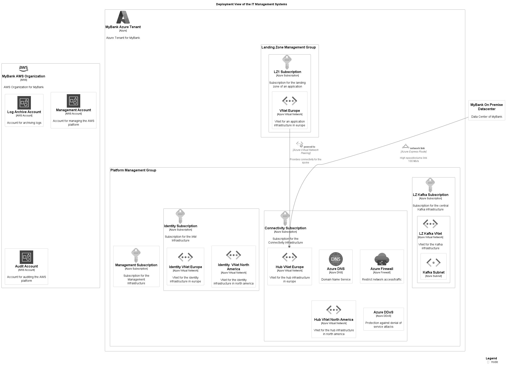

# Deployment View of the IT Management Systems

## Diagram

## Description
Shows the nodes and containers of the domain IT management infrastructure.

## Deployment Nodes
| Node | Description |
|---|---|
| [Audit Account](../../mybank/it-management/aws/audit-account.md)| Account for auditing the AWS platform |
| [Azure DDoS](../../mybank/it-management/azure/ddos-protection.md)| Protection against denial of service attacks |
| [Azure DNS](../../mybank/it-management/azure/dns.md)| Domain Name Service |
| [Azure Firewall](../../mybank/it-management/azure/firewall.md)| Restrict network access/traffic |
| [Connectivity Subscription](../../mybank/it-management/azure/connectivity-subscription.md)| Subscription for the Connectivity Infrastructure |
| [Hub VNet Europe](../../mybank/it-management/azure/hub-vnet-europe.md)| VNet for the hub infrastructure in europe |
| [Hub VNet North America](../../mybank/it-management/azure/hub-vnet-north-america.md)| VNet for the hub infrastructure in north america |
| [Identity  VNet North America](../../mybank/it-management/azure/identity-vnet-north-america.md)| VNet for the identity infrastructure in north america |
| [Identity Subscription](../../mybank/it-management/azure/identity-subscription.md)| Subscription for the IAM Infrastructure |
| [Identity VNet Europe](../../mybank/it-management/azure/identity-vnet-europe.md)| VNet for the identity infrastructure in europe |
| [Kafka Subnet](../../mybank/it-management/azure/plz-kafka-subnet.md)|  |
| [LZ Kafka Subscription](../../mybank/it-management/azure/plz-kafka-subscription.md)| Subscription for the central Kafka infrastructure |
| [LZ Kafka VNet](../../mybank/it-management/azure/plz-kafka-vnet.md)| VNet for the Kafka infrastructure |
| [LZ1 Subscription](../../mybank/it-management/azure/alz1-subscription.md)| Subscription for the landing zone of an application |
| [Landing Zone Management Group](../../mybank/it-management/azure/landing-zone-management-group.md)|  |
| [Log Archive Account](../../mybank/it-management/aws/log-archive-account.md)| Account for archiving logs |
| [Management Account](../../mybank/it-management/aws/platform-management-account.md)| Account for managing the AWS platform |
| [Management Subscription](../../mybank/it-management/azure/management-subscription.md)| Subscription for the Management Infrastructure |
| [MyBank AWS Organization](../../mybank/it-management/aws/mybank-aws-organization.md)| AWS Organization for MyBank |
| [MyBank Azure Tenant](../../mybank/it-management/azure/mybank-azure-tenant.md)| Azure Tenant for MyBank |
| [MyBank On Premise Datacenter](../../mybank/it-management/onprem/data-center-europe.md)| Data Center of MyBank |
| [Platform Management Group](../../mybank/it-management/azure/platform-management-group.md)|  |
| [VNet Europe](../../mybank/it-management/azure/alz1-vnet-europe.md)| VNet for an application infrastructure in europe |

## Navigation
[List of views in namespace](./views-in-namespace.md)

[List of all Views](../../views.md)

(generated by [Overarch](https://github.com/soulspace-org/overarch) with template docs/views/view.md.cmb)

