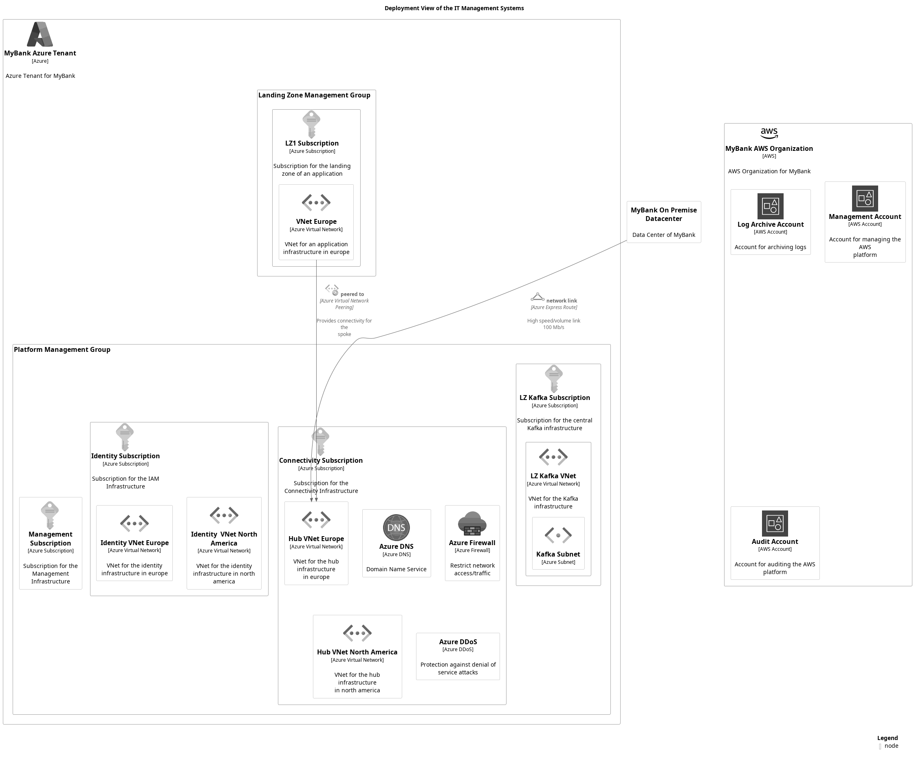

# Deployment View of the IT Management Systems

## Diagramm

## Description
Shows the nodes and containers of the domain IT management infrastructure.

## Nodes
| Name | Technology | Description |
|---|---|---|
| [Connectivity Subscription](../../mybank/it-management/azure/connectivity-subscription.md) | Azure Subscription | Subscription for the Connectivity Infrastructure |
| [Hub VNet](../../mybank/it-management/azure/hub-vnet.md) | Azure Virtual Network | VNet for the hub infrastructure |
| [Identity Subscription](../../mybank/it-management/azure/identity-subscription.md) | Azure Subscription | Subscription for the IAM Infrastructure |
| [Kafka Subnet](../../mybank/it-management/azure/lz-kafka-subnet.md) | Azure Subnet |  |
| [Landing Zone Management Group](../../mybank/it-management/azure/landing-zone-management-group.md) |  |  |
| [LZ Kafka Subscription](../../mybank/it-management/azure/lz-kafka-subscription.md) | Azure Subscription | Subscription for the central Kafka infrastructure |
| [LZ Kafka VNet](../../mybank/it-management/azure/lz-kafka-vnet.md) | Azure Virtual Network | VNet for the Kafka infrastructure |
| [LZ1 Subscription](../../mybank/it-management/azure/lz1-subscription.md) | Azure Subscription | Subscription for the landing zone 1 |
| [Management Subscription](../../mybank/it-management/azure/management-subscription.md) | Azure Subscription | Subscription for the Management Infrastructure |
| [MyBank Azure Tenant](../../mybank/it-management/azure/mybank-tenant.md) | Azure | Azure Tenant for MyBank |
| [MyBank On Premise Datacenter](../../mybank/it-management/onprem/data-center.md) |  | Data Center of MyBank |
| [Platform Management Group](../../mybank/it-management/azure/platform-management-group.md) |  |  |
| [VNet 1](../../mybank/it-management/azure/lz1-vnet1.md) | Azure Virtual Network | VNet for a spoke infrastructure |

## Links
| Name | From | To | Technology | Description |
|---|---|---|---|---|
| network link | MyBank On Premise Datacenter | Hub VNet | Azure Express Route | High speed/volume link 100 Mb/s |
| peered to | VNet 1 | Hub VNet | Azure Virtual Network Peering | Provides connectivity for the spoke |

(generated with docs/views/deployment-view.md.cmb)
