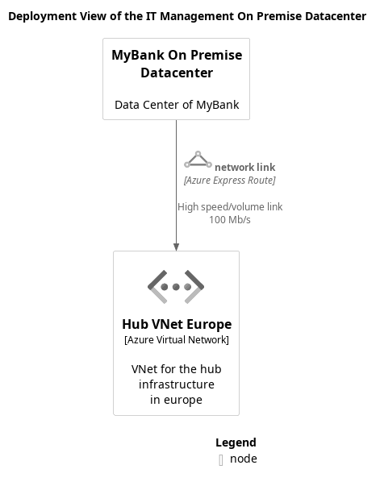

# Deployment View of the IT Management On Premise Datacenter

## Diagram

## Description
Shows the nodes and containers of the IT management on premise datacenter infrastructure.

## Nodes
| Name | Technology | Description |
|---|---|---|
| [Hub VNet Europe](../../../mybank/it-management/azure/hub-vnet-europe.md) | Azure Virtual Network | VNet for the hub infrastructure in europe |
| [MyBank On Premise Datacenter](../../../mybank/it-management/onprem/data-center-europe.md) |  | Data Center of MyBank |

## Links
| From | Name | To | Technology | Description |
|---|---|---|---|---|
| [MyBank On Premise Datacenter](../../../mybank/it-management/onprem/data-center-europe.md) | network link | [Hub VNet Europe](../../../mybank/it-management/azure/hub-vnet-europe.md) | Azure Express Route | High speed/volume link 100 Mb/s |

## Navigation
[List of views in namespace](./views-in-namespace.md)
[List of all Views](../../../views.md)

(generated with docs/views/deployment-view.md.cmb)
