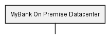

# Deployment View for the MyBank Onpremise Datacenters

## Diagram

## Description
Shows the hierarchical structure of the onpremise detacenter deployment

## Nodes
| Name | Technology | Description |
|---|---|---|
| [MyBank On Premise Datacenter](../../../mybank/it-management/onprem/data-center-europe.md) |  | Data Center of MyBank |

## Navigation
[List of views in namespace](./views-in-namespace.md)
[List of all Views](../../../views.md)

(generated with docs/views/deployment-structure-view.md.cmb)
