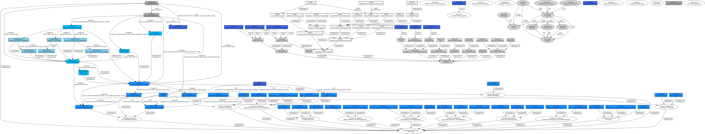

# Overview of the complete model

## Diagram

## Description
Shows the complete model graph

## Enterprise Boundaries
| Enterprise-boundary | Description |
|---|---|
| [My Bank](../mybank/mybank-plc.md)|  |

## Subdomains/Bounded Contexts
| Subdomain/Bounded Context | Description |
|---|---|
| [Core Banking System](../mybank/core-banking/context-boundary.md)| Manages customer accounts, transactions, and loans. |
| [Customer Channels](../mybank/customer-channels/context-boundary.md)| Interfaces for customer interaction, including branch systems, ATMs, and call centers. |
| [Data Management and Analytics](../mybank/data-management/context-boundary.md)| Manages data storage, warehousing, and analytics. |
| [Digital Banking](../mybank/digital-banking/context-boundary.md)| Enables online and mobile banking services for customers. |
| [Financial Management](../mybank/financial-management/context-boundary.md)| Handles financial accounting, treasury, and expense management. |
| [Human Resources Management](../mybank/human-resources/context-boundary.md)| Manages employee information, payroll, and talent management. |
| [IT Management](../mybank/it-management/context-boundary.md)| Manages IT infrastructure, cloud resources, and system monitoring. |
| [Integration and Middleware](../mybank/integration-middleware-context.md)| Facilitates integration across systems. |
| [Payment Systems](../mybank/payment/context-boundary.md)| Manages interbank payments, ACH, and SWIFT transactions. |
| [Project Management and Development](../mybank/project-management/context-boundary.md)| Tools for managing projects and software development. |
| [Risk Management and Compliance](../mybank/compliance/context-boundary.md)| Detects and mitigates risks, ensuring regulatory compliance. |
| [Security](../mybank/security/context-boundary.md)| Ensures the security of systems and data. |

## Concepts
| Concept | Description |
|---|---|
| [Account](../mybank/concepts/account.md)| Records the financial transactions between a customer and a bank |
| [Bank](../mybank/concepts/bank.md)| Organization providing services around money |
| [Corporate Customer](../mybank/concepts/corporate-customer.md)| An organization requesting services around money |
| [Customer](../mybank/concepts/customer.md)| Entity requesting services around money |
| [Deposit](../mybank/concepts/deposit.md)| Puts money on account |
| [Loan](../mybank/concepts/loan.md)| Lending money from the bank to the customer |
| [Mortgage](../mybank/concepts/mortgage.md)| A loan for a immobile, e.g. a house |
| [Personal Customer](../mybank/concepts/personal-customer.md)| A person requesting services around money |
| [Transfer](../mybank/concepts/transfer.md)| Moves money from one account to another account |
| [Withdrawal](../mybank/concepts/withdrawal.md)| Takes money from account |

## Generalizations
| From | Name | To | Description |
|---|---|---|---|
| [Corporate Customer](../mybank/concepts/corporate-customer.md) | is a | [Customer](../mybank/concepts/customer.md) |  |
| [Personal Customer](../mybank/concepts/personal-customer.md) | is a | [Customer](../mybank/concepts/customer.md) |  |
| [Mortgage](../mybank/concepts/mortgage.md) | is a | [Loan](../mybank/concepts/loan.md) |  |

## Features
| From | Name | To | Description |
|---|---|---|---|
| [Customer](../mybank/concepts/customer.md) | has | [Account](../mybank/concepts/account.md) |  |
| [Bank](../mybank/concepts/bank.md) | has | [Customer](../mybank/concepts/customer.md) |  |
| [Bank](../mybank/concepts/bank.md) | provides | [Account](../mybank/concepts/account.md) |  |
| [Bank](../mybank/concepts/bank.md) | provides | [Loan](../mybank/concepts/loan.md) |  |

## Organizations
| Organization | Description |
|---|---|
| [My Bank](../mybank/my-bank-organization.md)| My Bank Company |

## Organization Units
| Org-unit | Description |
|---|---|
| [AWS Platform](../mybank/it-management/aws-unit.md)| Responsible for the AWS cloud platform. |
| [Asset Management](../mybank/investments/asset-management-org.md)|  |
| [Azure Platform](../mybank/it-management/azure-unit.md)| Responsible for the Azure cloud platform. |
| [Compliance and Risk Management](../mybank/compliance/compliance-unit.md)| Responsible for the compliance and risk management of MyBank |
| [Corporate Customers](../mybank/organization/corporate-customers.md)|  |
| [Fraud](../mybank/compliance/fraud.md)|  |
| [Human Resources](../mybank/organization/human-resources-unit.md)| Central management of human resources |
| [IT Management](../mybank/it-management/it-management-unit.md)| Responsible for the IT platform of MyBank |
| [Internet Banking](../mybank/organization/personal-customers/internet-banking.md)|  |
| [Investments](../mybank/investments/investments-org.md)|  |
| [Loans](../mybank/organization/corporate-customers/loans-org.md)|  |
| [Marketing](../mybank/marketing/marketing-unit.md)| Responsible for the marketing of MyBank |
| [Mortgage](../mybank/organization/personal-customers/mortgage-org.md)|  |
| [On Premise Datacenter](../mybank/it-management/onprem-unit.md)| Responsible for the On Premise Datacenter. |
| [Personal Customers](../mybank/organization/personal-customers.md)|  |
| [Personal Loans](../mybank/organization/personal-customers/personal-loans-org.md)|  |
| [Projects](../mybank/project-management/project-management-unit.md)| Responsible for MyBank Projects |
| [Recruiting](../mybank/organization/hr/recruiting.md)| Responsible for recruiting new employees |
| [Regulations](../mybank/compliance/regulations.md)|  |
| [Risk Management](../mybank/compliance/risk-management.md)|  |

## Roles
| Person/Role | Description |
|---|---|
| [Agility Master](../mybank/project-management/agility-master.md)| Facilitates agile practices |
| [Backoffice Staff](../mybank/core-banking/backoffice-staff.md)| Administration and support staff within the bank. |
| [Cloud FinOps Specialist](../mybank/it-management/cloud-finops-specialist.md)| Operates cloud infrastructure and controls costs |
| [Cloud Operations Specialist](../mybank/it-management/cloud-operations-specialist.md)| Operates cloud infrastructure |
| [Cloud Solution Architect](../mybank/it-management/cloud-solution-architect.md)| Designs cloud solutions |
| [Compliance Manager](../mybank/compliance/compliance-manager.md)| Responsible for the compliance of MyBank. |
| [Corporate Customer](../mybank/corporate-customer.md)| Corporate Customer of MyBank. |
| [Customer Service Staff](../mybank/customer-channels/customer-service-staff.md)| Customer service staff within the bank. |
| [Database Administrator](../mybank/it-management/database-administrator.md)| Manages databases |
| [DevOps Engineer](../mybank/project-management/devops-engineer.md)| Develops and operates software systems |
| [Fraud specialist](../mybank/compliance/fraud-specialist.md)| Responsible for the fraud detection and mitigation of MyBank. |
| [IT Manager](../mybank/it-management/it-manager.md)| Manages the IT platform |
| [Incident Manager](../mybank/project-management/incident-manager.md)| Manages incidents |
| [Network Engineer](../mybank/it-management/network-engineer.md)| Designs and operates network infrastructure |
| [Personal Customer](../mybank/personal-customer.md)| Personal Customer of MyBank. |
| [Project Manager](../mybank/project-management/project-manager.md)| Manages projects at MyBank |
| [Quality Manager](../mybank/project-management/quality-manager.md)| Responsible for quality assurance and compliance to quality standards |
| [Risk Manager](../mybank/compliance/risk-manager.md)| Responsible for managing the risks. |
| [Security Engineer](../mybank/it-management/security-engineer.md)| Designs and operates security infrastructure |

## Capabilities
| Capability | Description |
|---|---|
| [Manage Projects](../mybank/project-management/manage-projects.md)| Capability to manage projects for the organization |

## Processes
| Process | Description |
|---|---|
| [Config Management](../mybank/project-management/config-management.md)| Process to manage configurations and baselines |
| [Incident Management](../mybank/project-management/incident-management.md)| Process to manage incidents |
| [Project Management](../mybank/project-management/project-management.md)| Process to manage projects |
| [Release Management](../mybank/project-management/release-management.md)| Process to manage software releases |
| [Requirements Management](../mybank/project-management/requirements-management.md)| Process to manage requirements for projects |
| [Software Development](../mybank/project-management/software-development.md)| Process to develop software |
| [Test Management](../mybank/project-management/test-management.md)| Process to manage testing |

## Use Cases
| Use Case | Description |
|---|---|
| [Document Project](../mybank/project-management/document-project.md)| Document a project |
| [Manage Backlog](../mybank/project-management/manage-backlog.md)| Manage the backlog of user stories |
| [Manage Sprints](../mybank/project-management/manage-sprints.md)| Manage sprints for software development |
| [place order](../mybank/digital-banking/internet-banking-system/place-order.md)| place an order for an account |
| [transfer money](../mybank/digital-banking/internet-banking-system/transfer-money.md)| transfer money from one account to another |
| [view account](../mybank/digital-banking/internet-banking-system/view-account.md)| view the details of an account |

## Uses
| From | Name | To | Description |
|---|---|---|---|
| [Agility Master](../mybank/project-management/agility-master.md) | uses | [Manage Sprints](../mybank/project-management/manage-sprints.md) |  |
| [Personal Customer](../mybank/personal-customer.md) | wants to | [place order](../mybank/digital-banking/internet-banking-system/place-order.md) |  |
| [Personal Customer](../mybank/personal-customer.md) | wants to | [view account](../mybank/digital-banking/internet-banking-system/view-account.md) |  |
| [Personal Customer](../mybank/personal-customer.md) | wants to | [transfer money](../mybank/digital-banking/internet-banking-system/transfer-money.md) |  |

## Systems
| System | Description |
|---|---|
| [ACH System](../mybank/payment/ach-system.md)| Processes ACH transactions for direct deposits and bill payments. |
| [API Gateway](../mybank/integration-middleware/api-gateway.md)| Manages APIs for third-party services and fintech apps. |
| [ATM](../mybank/customer-channels/atm.md)| Allows customers to withdraw cash. |
| [Account Management](../mybank/core-banking/account-management-system.md)| Handles customer accounts, deposits, and withdrawals. |
| [Anti-Money Laundering (AML) System](../mybank/compliance/aml-system.md)| Monitors and prevents money laundering activities. |
| [Big Data Analytics](../mybank/data-management/big-data-analytics-system.md)| Advanced analytics for predictive modeling. |
| [Branch Systems](../mybank/customer-channels/branch-systems.md)| Software and hardware for in-branch banking services. |
| [Business Intelligence (BI)](../mybank/data-management/business-intelligence-system.md)| Provides tools for reporting and data analysis. |
| [Cloud Services](../mybank/infrastructure-management/cloud-services-system.md)| Cloud computing resources for scalability and flexibility. |
| [Compliance System](../mybank/compliance/compliance-system.md)| Ensures operations comply with regulations. |
| [Contact Center](../mybank/customer-channels/contact-center-system.md)| Telephony and customer support systems for call centers. |
| [Cybersecurity](../mybank/security/cybersecurity-system.md)| Protects against cyber threats. |
| [Data Warehouse](../mybank/data-management/data-warehouse-system.md)| Central repository for storing large volumes of data. |
| [Development Platform](../mybank/project-management/gitlab.md)| Tools for software development, testing, and deployment. |
| [Digital Wallets](../mybank/digital-banking/digital-wallets-system.md)| Supports digital wallet integration and mobile payments. |
| [Disaster Recovery](../mybank/security/disaster-recovery-system.md)| Ensures business continuity in case of a disaster. |
| [E-mail System](../mybank/email-system.md)| The internal Microsoft Exchange email system. |
| [Enterprise Service Bus (ESB)](../mybank/integration-middleware/esb.md)| Middleware for integrating various banking systems. |
| [Expense Management](../mybank/financial-management/expense-management-system.md)| Tracks and manages expenses. |
| [Fraud Detection System](../mybank/compliance/fraud-detection-system.md)| Detects and mitigates fraudulent activities. |
| [General Ledger](../mybank/financial-management/general-ledger-system.md)| Comprehensive financial accounting and reporting system. |
| [HR Information Systems (HRIS)](../mybank/human-resources/hris.md)| Manages employee data, payroll, and benefits. |
| [IT Infrastructure](../mybank/infrastructure-management/it-infrastructure-system.md)| Hardware and software resources, including servers and networking. |
| [Identity and Access Management (IAM)](../mybank/security/identity-access-management-system.md)| Manages secure access to systems and data. |
| [Internet Banking System](../mybank/digital-banking/internet-banking-system/internet-banking-system.md)| Allows customers to view information about their bank accounts and make payments. |
| [Loan Management](../mybank/core-banking/loan-management-system.md)| Manages loan products, applications, and repayments. |
| [Payment Gateway](../mybank/payment/payment-gateway-system.md)| Facilitates credit/debit card transactions. |
| [Project Management Tool](../mybank/project-management/jira.md)| Platform for planning, executing, and tracking projects. |
| [Projects Wiki](../mybank/project-management/confluence.md)| Platform for documenting projects. |
| [Risk Management System](../mybank/compliance/risk-management-system.md)| Detects risks and manages risk mitigation. |
| [SWIFT/RTGS/NEFT](../mybank/payment/swift-rtgs-neft-system.md)| Handles interbank transfers and settlements. |
| [Service-Oriented Architecture (SOA)](../mybank/integration-middleware/soa.md)| Framework for enabling seamless integration between services. |
| [System Monitoring](../mybank/infrastructure-management/system-monitoring-system.md)| Monitors system performance and health. |
| [Talent Management](../mybank/human-resources/talent-management-system.md)| Tools for recruitment, training, and performance management. |
| [Transaction Processing](../mybank/core-banking/transaction-processing-system.md)| Processes financial transactions in real-time. |
| [Treasury Management](../mybank/financial-management/treasury-management-system.md)| Manages liquidity, investments, and risk in the treasury function. |

## Containers
| Container | Description |
|---|---|
| [API Application](../mybank/digital-banking/internet-banking-system/api-application.md)| Provides internet banking functionality via a RESTful JSON/HTTPS API. |
| [Database](../mybank/digital-banking/internet-banking-system/database.md)| Stores user registration, authentication, and access logs. |
| [Mobile App](../mybank/digital-banking/internet-banking-system/mobile-app.md)| Provides limited internet banking functionality to customers via mobile devices. |
| [Single-Page Application](../mybank/digital-banking/internet-banking-system/single-page-app.md)| Provides internet banking functionality to customers via their web browser. |
| [Web Application](../mybank/digital-banking/internet-banking-system/web-app.md)| Delivers the static content and the internet banking single-page application. |

## Components
| Component | Description |
|---|---|
| [Accounts Summary Controller](../mybank/digital-banking/internet-banking-system/accounts-summary-controller.md)| Provides customers with a summary of their bank accounts. |
| [Core Banking Systems Facade](../mybank/digital-banking/internet-banking-system/core-banking-systems-facade.md)| Facilitates interaction with the core banking systems. |
| [E-mail Component](../mybank/digital-banking/internet-banking-system/email-component.md)| Sends e-mails to users. |
| [Reset Password Controller](../mybank/digital-banking/internet-banking-system/reset-password-controller.md)| Allows users to reset their passwords. |
| [Security Component](../mybank/digital-banking/internet-banking-system/security-component.md)| Handles authentication, password changes, etc. |
| [Sign In Controller](../mybank/digital-banking/internet-banking-system/sign-in-controller.md)| Allows users to sign in to the banking system. |

## Synchronous Requests
| From | Name | To | Technology | Description |
|---|---|---|---|---|
| [Internet Banking System](../mybank/digital-banking/internet-banking-system/internet-banking-system.md) | fetches loan details and payment status from | [Loan Management](../mybank/core-banking/loan-management-system.md) |  |  |
| [Risk Management System](../mybank/compliance/risk-management-system.md) | fetches transaction history and customer data from | [Transaction Processing](../mybank/core-banking/transaction-processing-system.md) |  |  |
| [Internet Banking System](../mybank/digital-banking/internet-banking-system/internet-banking-system.md) | gets account information from, and makes payments using | [Account Management](../mybank/core-banking/account-management-system.md) |  |  |
| [API Application](../mybank/digital-banking/internet-banking-system/api-application.md) | makes API calls to | [Account Management](../mybank/core-banking/account-management-system.md) | REST |  |
| [Mobile App](../mybank/digital-banking/internet-banking-system/mobile-app.md) | makes API calls to | [API Application](../mybank/digital-banking/internet-banking-system/api-application.md) | Transit/HTTPS |  |
| [Single-Page Application](../mybank/digital-banking/internet-banking-system/single-page-app.md) | makes API calls to | [Sign In Controller](../mybank/digital-banking/internet-banking-system/sign-in-controller.md) | Transit/HTTPS |  |
| [Single-Page Application](../mybank/digital-banking/internet-banking-system/single-page-app.md) | makes API calls to | [Reset Password Controller](../mybank/digital-banking/internet-banking-system/reset-password-controller.md) | Transit/HTTPS |  |
| [Single-Page Application](../mybank/digital-banking/internet-banking-system/single-page-app.md) | makes API calls to | [Accounts Summary Controller](../mybank/digital-banking/internet-banking-system/accounts-summary-controller.md) | Transit/HTTPS |  |
| [Internet Banking System](../mybank/digital-banking/internet-banking-system/internet-banking-system.md) | processes customer payments using | [Payment Gateway](../mybank/payment/payment-gateway-system.md) |  |  |
| [API Application](../mybank/digital-banking/internet-banking-system/api-application.md) | reads from and writes to | [Database](../mybank/digital-banking/internet-banking-system/database.md) | Datalog |  |
| [Accounts Summary Controller](../mybank/digital-banking/internet-banking-system/accounts-summary-controller.md) | retrieves account data from | [Core Banking Systems Facade](../mybank/digital-banking/internet-banking-system/core-banking-systems-facade.md) |  |  |
| [Loan Management](../mybank/core-banking/loan-management-system.md) | retrieves customer account information from | [Account Management](../mybank/core-banking/account-management-system.md) |  |  |
| [Internet Banking System](../mybank/digital-banking/internet-banking-system/internet-banking-system.md) | sends e-mail using | [E-mail System](../mybank/email-system.md) |  |  |
| [API Application](../mybank/digital-banking/internet-banking-system/api-application.md) | sends e-mail using | [E-mail System](../mybank/email-system.md) | SMTP |  |
| [Compliance Manager](../mybank/compliance/compliance-manager.md) | uses | [Compliance System](../mybank/compliance/compliance-system.md) |  | generate compliance reports |
| [Personal Customer](../mybank/personal-customer.md) | uses | [Digital Wallets](../mybank/digital-banking/digital-wallets-system.md) |  |  |
| [Fraud specialist](../mybank/compliance/fraud-specialist.md) | uses | [Fraud Detection System](../mybank/compliance/fraud-detection-system.md) |  | generate fraud reports |
| [Sign In Controller](../mybank/digital-banking/internet-banking-system/sign-in-controller.md) | uses | [Security Component](../mybank/digital-banking/internet-banking-system/security-component.md) |  |  |
| [Risk Manager](../mybank/compliance/risk-manager.md) | uses | [Risk Management System](../mybank/compliance/risk-management-system.md) |  | generate risk reports |
| [Personal Customer](../mybank/personal-customer.md) | uses atm for balance information and withdrawals | [ATM](../mybank/customer-channels/atm.md) |  |  |
| [Reset Password Controller](../mybank/digital-banking/internet-banking-system/reset-password-controller.md) | uses for sending password reset emails | [E-mail Component](../mybank/digital-banking/internet-banking-system/email-component.md) |  |  |
| [Payment Gateway](../mybank/payment/payment-gateway-system.md) | validates and processes payments using | [Transaction Processing](../mybank/core-banking/transaction-processing-system.md) |  |  |
| [Personal Customer](../mybank/personal-customer.md) | views account balances and makes payments using | [Single-Page Application](../mybank/digital-banking/internet-banking-system/single-page-app.md) |  |  |
| [Personal Customer](../mybank/personal-customer.md) | views account balances and makes payments using | [Internet Banking System](../mybank/digital-banking/internet-banking-system/internet-banking-system.md) |  |  |
| [Personal Customer](../mybank/personal-customer.md) | views account balances and makes payments using | [Mobile App](../mybank/digital-banking/internet-banking-system/mobile-app.md) |  |  |
| [Personal Customer](../mybank/personal-customer.md) | visits mybank.com via browser | [Web Application](../mybank/digital-banking/internet-banking-system/web-app.md) | HTTPS |  |

## Deployment Nodes
| Node | Description |
|---|---|
| [Audit Account](../mybank/it-management/aws/audit-account.md)| Account for auditing the AWS platform |
| [Azure DDoS](../mybank/it-management/azure/ddos-protection.md)| Protection against denial of service attacks |
| [Azure DNS](../mybank/it-management/azure/dns.md)| Domain Name Service |
| [Azure Firewall](../mybank/it-management/azure/firewall.md)| Restrict network access/traffic |
| [Connectivity Subscription](../mybank/it-management/azure/connectivity-subscription.md)| Subscription for the Connectivity Infrastructure |
| [Hub VNet Europe](../mybank/it-management/azure/hub-vnet-europe.md)| VNet for the hub infrastructure in europe |
| [Hub VNet North America](../mybank/it-management/azure/hub-vnet-north-america.md)| VNet for the hub infrastructure in north america |
| [Identity  VNet North America](../mybank/it-management/azure/identity-vnet-north-america.md)| VNet for the identity infrastructure in north america |
| [Identity Subscription](../mybank/it-management/azure/identity-subscription.md)| Subscription for the IAM Infrastructure |
| [Identity VNet Europe](../mybank/it-management/azure/identity-vnet-europe.md)| VNet for the identity infrastructure in europe |
| [Kafka Subnet](../mybank/it-management/azure/plz-kafka-subnet.md)|  |
| [LZ Kafka Subscription](../mybank/it-management/azure/plz-kafka-subscription.md)| Subscription for the central Kafka infrastructure |
| [LZ Kafka VNet](../mybank/it-management/azure/plz-kafka-vnet.md)| VNet for the Kafka infrastructure |
| [LZ1 Subscription](../mybank/it-management/azure/alz1-subscription.md)| Subscription for the landing zone of an application |
| [Landing Zone Management Group](../mybank/it-management/azure/landing-zone-management-group.md)|  |
| [Log Archive Account](../mybank/it-management/aws/log-archive-account.md)| Account for archiving logs |
| [Management Account](../mybank/it-management/aws/platform-management-account.md)| Account for managing the AWS platform |
| [Management Subscription](../mybank/it-management/azure/management-subscription.md)| Subscription for the Management Infrastructure |
| [MyBank AWS Organization](../mybank/it-management/aws/mybank-aws-organization.md)| AWS Organization for MyBank |
| [MyBank Azure Tenant](../mybank/it-management/azure/mybank-azure-tenant.md)| Azure Tenant for MyBank |
| [MyBank On Premise Datacenter](../mybank/it-management/onprem/data-center-europe.md)| Data Center of MyBank |
| [Platform Management Group](../mybank/it-management/azure/platform-management-group.md)|  |
| [VNet Europe](../mybank/it-management/azure/alz1-vnet-europe.md)| VNet for an application infrastructure in europe |

## Other Relationships
| From | Name | To | Description |
|---|---|---|---|
| [Personal Customer](../mybank/personal-customer.md) | asks questions to | [Customer Service Staff](../mybank/customer-channels/customer-service-staff.md) |  |
| [Backoffice Staff](../mybank/core-banking/backoffice-staff.md) | assesses customer risk for loan approval using | [Compliance System](../mybank/compliance/compliance-system.md) |  |
| [Transfer](../mybank/concepts/transfer.md) | between | [Account](../mybank/concepts/account.md) |  |
| [Withdrawal](../mybank/concepts/withdrawal.md) | from | [Account](../mybank/concepts/account.md) |  |
| [Customer](../mybank/concepts/customer.md) | performs | [Transfer](../mybank/concepts/transfer.md) |  |
| [Customer](../mybank/concepts/customer.md) | performs | [Deposit](../mybank/concepts/deposit.md) |  |
| [Customer](../mybank/concepts/customer.md) | performs | [Withdrawal](../mybank/concepts/withdrawal.md) |  |
| [Backoffice Staff](../mybank/core-banking/backoffice-staff.md) | processes loan applications and updates loan status using | [Loan Management](../mybank/core-banking/loan-management-system.md) |  |
| [Customer](../mybank/concepts/customer.md) | requests | [Loan](../mybank/concepts/loan.md) |  |
| [ATM](../mybank/customer-channels/atm.md) | retrieves account balance | [Account Management](../mybank/core-banking/account-management-system.md) |  |
| [Customer Service Staff](../mybank/customer-channels/customer-service-staff.md) | sends and receives customer communication using | [E-mail System](../mybank/email-system.md) |  |
| [Deposit](../mybank/concepts/deposit.md) | to | [Account](../mybank/concepts/account.md) |  |
| [Backoffice Staff](../mybank/core-banking/backoffice-staff.md) | validates and processes payments using | [Payment Gateway](../mybank/payment/payment-gateway-system.md) |  |
| [ATM](../mybank/customer-channels/atm.md) | validates transaction | [Transaction Processing](../mybank/core-banking/transaction-processing-system.md) |  |

## Navigation
[List of views in namespace](./views-in-namespace.md)

[List of all Views](../views.md)

(generated by [Overarch](https://github.com/soulspace-org/overarch) with template docs/views/view.md.cmb)

