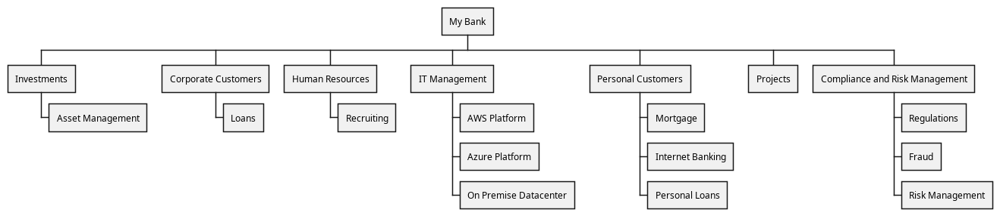

# Human Resources (Org-unit)
## Description
Central management of human resources

## Parent
[My Bank](../../mybank/my-bank-organization.md)

## Sub Units
| Org-unit | Description |
|---|---|
| [Recruiting](../../mybank/organization/hr/recruiting.md)| Responsible for recruiting new employees |

## Organization Structure

[MyBank Organization Chart](../../mybank/organization/organization-structure-view.md)

## Navigation
[List of views in namespace](./views-in-namespace.md)

[List of all Views](../../views.md)

(generated by [Overarch](https://github.com/soulspace-org/overarch) with template docs/node.md.cmb)
