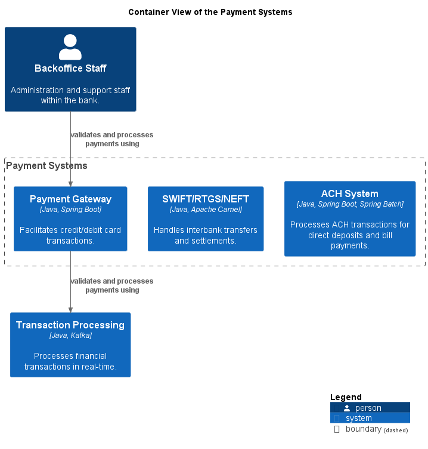

# Container View of the Payment Systems

## Diagramm

## Description
Shows the systems and containers of the domain Payment and their relations.
## Systems
| Name | Description |
|---|---|
| [ACH System](../../mybank/payment/ach-system.md) | Processes ACH transactions for direct deposits and bill payments. |
| [Payment Gateway](../../mybank/payment/payment-gateway-system.md) | Facilitates credit/debit card transactions. |
| [SWIFT/RTGS/NEFT](../../mybank/payment/swift-rtgs-neft-system.md) | Handles interbank transfers and settlements. |

(generated with docs/views/container-view.md.cmb)
