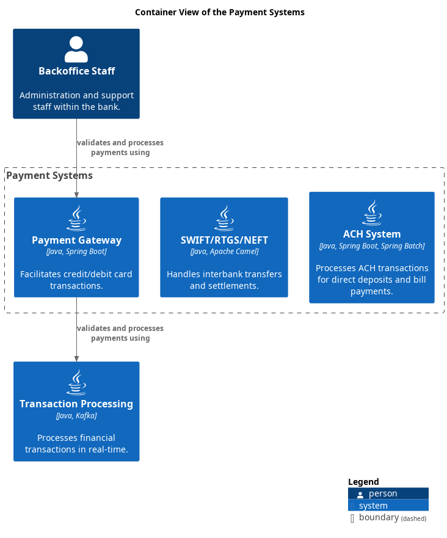

# Payment Systems (Context-boundary)
## Description
Manages interbank payments, ACH, and SWIFT transactions.

## Parent
[My Bank](../../mybank/mybank-plc.md)

## Container View

[Container View of the Payment Systems](../../mybank/payment/container-view.md)

## Navigation
[List of views in namespace](./views-in-namespace.md)

[List of all Views](../../views.md)

(generated by [Overarch](https://github.com/soulspace-org/overarch) with template docs/node.md.cmb)
