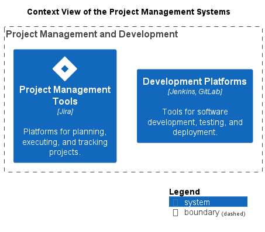

# Context View of the Project Management Systems

## Diagramm

## Description
Shows the systems of the domain Project Management and their relations.
## User Roles
| Name | Description |
|---|---|
| [Project Manager](../../mybank/project-management/project-manager.md) | Manages projects at MyBank. |
## Systems
| Name | Description |
|---|---|
| [Development Platforms](../../mybank/project-management/dev-platforms.md) | Tools for software development, testing, and deployment. |
| [Project Management Tools](../../mybank/project-management/project-management-tools.md) | Platforms for planning, executing, and tracking projects. |

(generated with docs/views/context-view.md.cmb)
