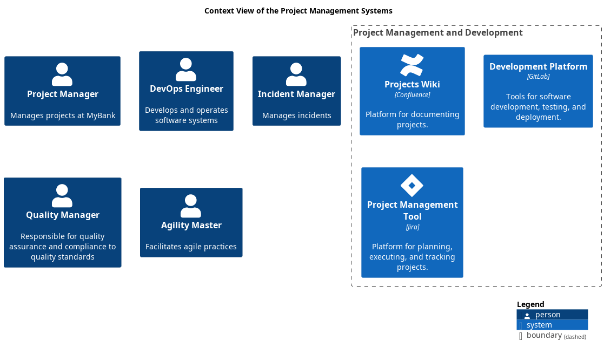

# Context View of the Project Management Systems

## Diagram

## Description
Shows the systems of the domain Project Management and their relations.
## User Roles
| Name | Description |
|---|---|
| [Agility Master](../../mybank/project-management/agility-master.md) | Facilitates agile practices |
| [DevOps Engineer](../../mybank/project-management/devops-engineer.md) | Develops and operates software systems |
| [Project Manager](../../mybank/project-management/project-manager.md) | Manages projects at MyBank |
## Systems
| Name | Description |
|---|---|
| [Development Platform](../../mybank/project-management/gitlab.md) | Tools for software development, testing, and deployment. |
| [Project Management Tool](../../mybank/project-management/jira.md) | Platform for planning, executing, and tracking projects. |
| [Projects Wiki](../../mybank/project-management/confluence.md) | Platform for documenting projects. |

(generated with docs/views/context-view.md.cmb)
