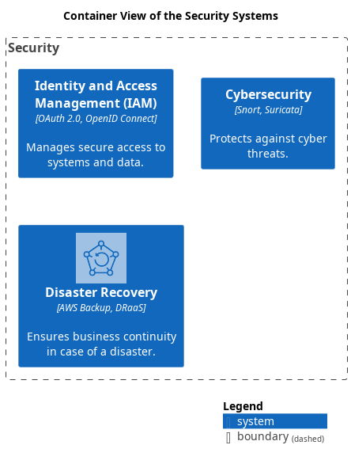

# Container View of the Security Systems

## Diagram

## Description
Shows the systems and containers of the domain Security and their relations.

## Subdomains/Bounded Contexts
| Subdomain/Bounded Context | Description |
|---|---|
| [Security](../../mybank/security/context-boundary.md)| Ensures the security of systems and data. |

## Systems
| System | Description |
|---|---|
| [Cybersecurity](../../mybank/security/cybersecurity-system.md)| Protects against cyber threats. |
| [Disaster Recovery](../../mybank/security/disaster-recovery-system.md)| Ensures business continuity in case of a disaster. |
| [Identity and Access Management (IAM)](../../mybank/security/identity-access-management-system.md)| Manages secure access to systems and data. |

## Navigation
[List of views in namespace](./views-in-namespace.md)

[List of all Views](../../views.md)

(generated by [Overarch](https://github.com/soulspace-org/overarch) with template docs/views/view.md.cmb)

