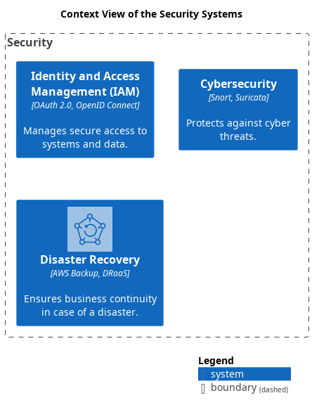

# Identity and Access Management (IAM)
## Description
Manages secure access to systems and data.

## Technology
OAuth 2.0, OpenID Connect

## Interfaces

## System Context View

[Security Context View](../../mybank/security/context-view.md)

(generated with docs/architecture-node.md.cmb)
